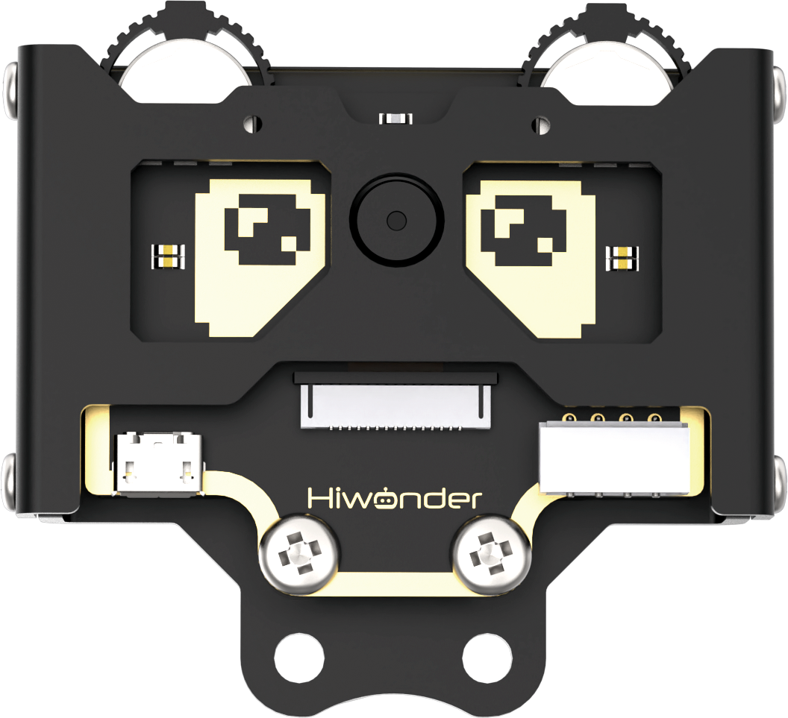

# 1. Nexbit Introduction

## 1.1 Product Introduction 

Nextbit is an AI robot car powered by micro:bit. Featuring a 4-channel knob line follower, an AI vision module, a glowy ultrasonic sensor, an IR receiver, RGB lights, Nexbit can perform fundamental tasks such as intersection detection, autonomous line following, and obstacle detection and avoidance. Moreover, it's equipped to handle more complex tasks like road sign recognition, autonomous driving, face recognition, and a wide range of AI games. Nexbit also provides multiple servo and sensor ports, allowing seamless project expansion.

## 1.2 Packing List

**(1) Nexbit Starter Packing List**

| **No.** |           **Components**            | **Quantity** |                                  **Picture**                                   |
| :-----: | :---------------------------------: | :----------: |:------------------------------------------------------------------------------:|
|    1    |         Nexbit Lower Board          |      1       |   |
|    2    |            Battery slot             |      1       |    |
|    3    |       Glowy ultrasonic sensor       |      1       |    |
|    4    |   Glowy ultrasonic sensor bracket   |      1       |   |
|    5    | 50mm 2PIN wire +100mm 4PIN wire * 2 |      3       |    |
|    6    |           USB data cable            |      1       |   |
|    7    |         18650 Lipo battery          |      1       |   |
|    8    |                 Map                 |      1       |   |
|    9    |            Accessory bag            |      1       |   |
|   10    |             Screwdriver             |      1       |  |
|   11    |         micro:bit(optional)         |      1       |  |
|   12    |             User manual             |      1       |  |

**(2) Nexbit Standard Packing List**

| **No.** |                **Components**                 | **Quantity** |                                  **Picture**                                   |
| :-----: | :-------------------------------------------: | :----------: |:------------------------------------------------------------------------------:|
|    1    |         Nexbit Lower Board          |      1       |   |
|    2    |            Battery slot             |      1       |    |
|    3    |       Glowy ultrasonic sensor       |      1       |    |
|    4    |   Glowy ultrasonic sensor bracket   |      1       |   |
|    5    | 50mm 2PIN wire +100mm 4PIN wire * 2 |      3       |    |
|    6    |           USB data cable            |      1       |   |
|    7    |         18650 Lipo battery          |      1       |   |
|    8    |                 Map                 |      1       |   |
|    9    |            Accessory bag            |      1       |   |
|   10    |             Screwdriver             |      1       |  |
|   11    |         micro:bit(optional)         |      1       |  |
|   12    | WonderCam vision module(with protective case) |      1       |  |
|   13    |                200mm 4PIN wire                |      1       |  |
|   14    |              TOP - View bracket               |      1       |   |
|   15    |                  Waste cards                  |      1       |   |
|   16    |                     Tags                      |      1       |  |
|   17    |                 Traffic signs                 |      1       |                      |
|   18    |                 Number cards                  |      1       |                      |
|   12    |             User manual             |      1       |  |