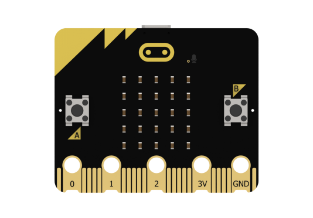
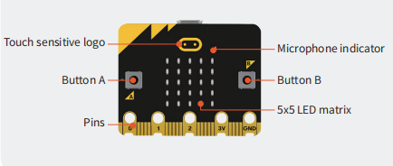
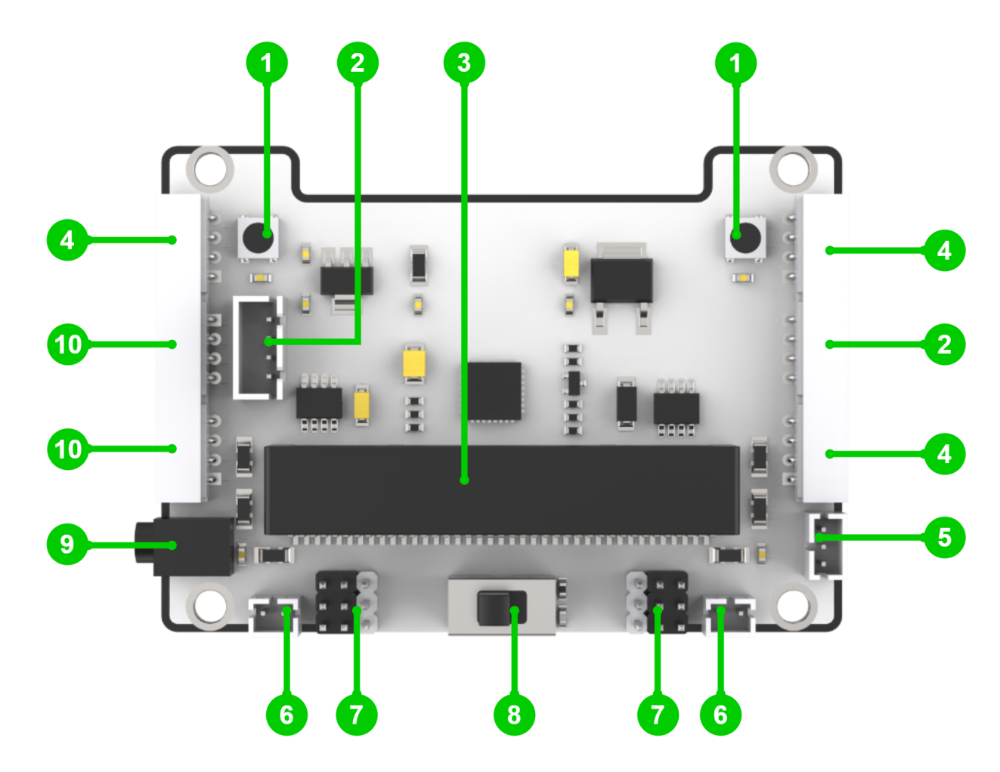

# 2. Introduction to micro:bit and Expansion Board

## 2.1 micro:bit 

### 2.1.1 Introduction

micro:bit is a microcontroller designed for programming education for adolescents. Being led by BBC, it is jointly developed by Microsoft, Samsung, ARM and other partners.

The size of micro:bit merely accounts for half of the bank card. Although the size is small, many rich functional electronic modules have been well equipped on it, including Bluetooth, an accelerometer, an electronic compass, three buttons, a 5x5 LED dot matric, and a microphone.

Micro:bit features numerous open-source libraries and interesting solutions, which can be accessed on the website:<https://makecode.microbit.org/>

### 2.1.2 Parameter

- Processor: Nordic nRF52833

- ARM: Cortex-M4 32-bit+FPU 64MHz

- Memory/Flash: 128KB RAM/512KB Flash

- Wireless: 2.4GHz Micro:bit Radio/BLE BT 5.0

- Power: 5V powered through Micro USB port, 3V powered through edge connector or battery pack

- Working current: 300mA

- Dimension: 52\*43.2mm

### 2.1.3 Function Diagram

As shown below, micro:bit is mainly composed of built-in modules, such as an accelerometer, programmable buttons, pins, LED dot matrix, USB, Bluetooth, radio, and electronic compass.

### 2.1.4 Module Function

- Built-in speaker

- MEMS microphone with LED indicator

- Touch-sensitive logo

- Built-in sleep or shutdown mode allows you to turn off the circuit power without removing the battery

- Discrete voltage regulator can provide up to 200mA of current to peripherals

- Edge connector for connecting alligator clips and wires

### 2.1.5 Pin Output

## 2.2 micro:bit Expansion Board

### 2.2.1 Introduction

The micro:bit expansion board is specially designed to facilitate the usage of micro:bit. It not only brings out the pins of micro:bit, but also adds different sensors and controllable components.

The micro:bit expansion board integrates two RGB lights, a buzzer, a sound sensor, six servo control ports, two DC motor interfaces, and six expansion ports.

### 2.2.2 Parameter

- Compatible with micro:bit

- Power input: 5V (USB power input) / 7.4V (DC power input)

- Dimension: 83\*60mm

### 2.2.3 Function Diagram

| 1.RGB light module       | 2.Serial communication interface |
|--------------------------|:--------------------------------:|
| 3.micro:bit socket       |         4.I2C interface          |
| 5.Power output interface |        6.Motor interface         |
| 7.PWM servo interface    |          8.Power switch          |
| 9.DC power interface     |         10.IO interface          |

### 2.2.4 Installation Diagram

The installation method for the micro:bit is shown below:

