# 4. microbit Basic Lesson

## 4.1 Logo Control

### 4.1.1 Getting Ready

The position of the Logo on the micro:bit.

### 4.1.2 Learning Objective

Program the Logo on the micro:bit to switch patterns.

### 4.1.3 Project Logic

The Logo on the micro:bit V2.0 version is a metal capacitive touch sensor, which serves as a button. When touched, it will return a digital signal to the micro:bit.

In the program, the touch condition can be determined based on the returned value. When the condition is met, the micro:bit will play a sound, and the LED dot matrix will scroll to display the image.

### 4.1.4 Program Writing

- **Coding block learning**

|                       **Coding block**                       |                          **Class**                           |                         **Function**                         |
| :----------------------------------------------------------: | :----------------------------------------------------------: | :----------------------------------------------------------: |
| 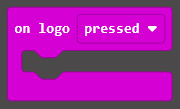 |  |             Set the triggered state of the logo.             |
|  |  |                Select to play the set sound.                 |
| 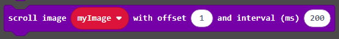 |  | Scroll an image from one side of the LED screen to the other side. |

- **Coding block combination**

### 4.1.5 Connect Device and Download Program

(1) Connect the micro:bit to the computer's serial port with the USB cable.

(2) Click "**...**" button next to "**Download**" and select "**Connect Device**".

(3) Then click "**Pair**" in the pop-up interface.

(4) Click "**Connect**".

(5) After the device is connected successfully, click "**Download**". The yellow indicator on the micro:bit near USB port will blink fast. At this time, do not disconnect or move USB cable to avoid failure download.

(6) After the download is completed, the indicator will stop blinking and keep lighting up. The interface will prompt "**Download completed**".

:::{Note}

There should only be two files in the micro:bit drive from beginning to end, as shown in the figure. The DETAILS.TXT file is used to record some parameters of the micro:bit and generally does not need to be concerned. The MICROBIT.HTM file is the official website page of the micro:bit. Clicking on this file requires the computer to be connected to the Internet.

:::

### 4.1.6 Project Outcome

After the program is downloaded, when you touch the logo, the micro:bit will play the set sound and display a scrolling heart pattern on its LED dot matrix.

## 4.2 Intelligent Thermometer

### 4.2.1 Getting Ready

The position of the main chip on the micro:bit.

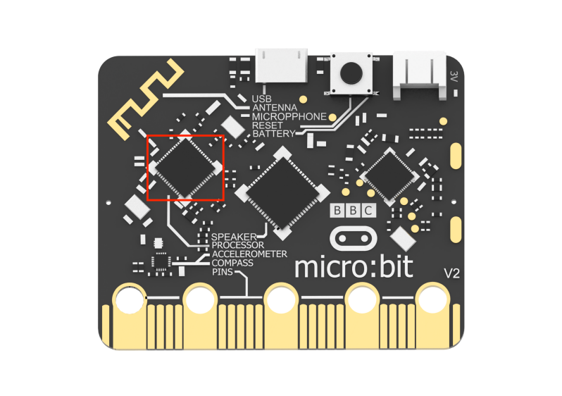

### 4.2.2 Learning Objective

(1) Learn about the micro:bit chip and related coding blocks.

(2) Use the micro:bit chip to achieve temperature detection.

### 4.2.3 Project Logic

The micro:bit V2.0 uses nRF52833 as its main chip, which allows the micro:bit to detect the current temperature in degrees Celsius and Fahrenheit.

In this lesson, let's detect temperature and set temperature conditions to determine when to play a sound. 

### 4.2.4 Program Writing

- **Coding block learning**

|                       **Coding block**                       |                          **Class**                           |                 **Function**                 |
| :----------------------------------------------------------: | :----------------------------------------------------------: | :------------------------------------------: |
| 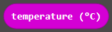 |  | Read the temperature in the unit of Celsius. |
|  |  |     Play the sound until it is finished.     |

- **Coding block combination**

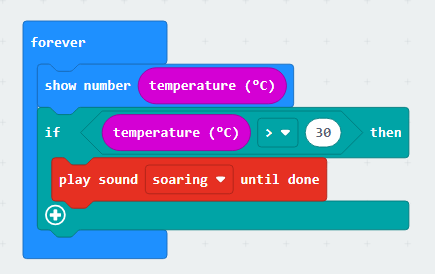

### 4.2.5 Connect Device and Download Program

(1) Connect the micro:bit to the computer's serial port with the USB cable.

(2) Click "**...**" button next to "**Download**" and select "**Connect Device**".

(3) Then click "**Pair**" in the pop-up interface.

(4) Click "**Connect**".

(5) After the device is connected successfully, click "**Download**". The yellow indicator on the micro:bit near USB port will blink fast. At this time, do not disconnect or move USB cable to avoid failure download.

(6) After the download is completed, the indicator will stop blinking and keep lighting up. The interface will prompt "**Download completed**".

:::{Note}

There should only be two files in the micro:bit drive from beginning to end, as shown in the figure. The DETAILS.TXT file is used to record some parameters of the micro:bit and generally does not need to be concerned. The MICROBIT.HTM file is the official website page of the micro:bit. Clicking on this file requires the computer to be connected to the Internet.

:::

### 4.2.6 Project Outcome

When you tap the main chip on the micro:bit, and the temperature is detected exceeding 30 degrees, the buzzer will emit a sound.

## 4.3 Timer

### 4.3.1 Getting Ready

The positions of the buttons on the micro:bit.

### 4.3.2 Learning Objective

Program the buttons on the micro:bit to implement the timing.

### 4.3.3 Project Logic

There are two buttons labeled A and B on the micro:bit. They can be programmed to run code once pressed, and the duration of the press can also be detected.

In this lesson, let's create a variable to store the times that the button A is pressed, and use this number to set time. Then, use button B to confirm the setting. Finally, trigger a sound prompt based on the condition.

### 4.3.4 Program Writing

- **Coding block learning**

|                       **Coding block**                       |                          **Class**                           |                         **Function**                         |
| :----------------------------------------------------------: | :----------------------------------------------------------: | :----------------------------------------------------------: |
|  |  | Display the set number on the LED dot matrix. If the number has multiple digits, it will scroll to display. |
| 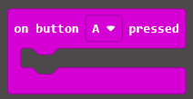 |  | When button A, B, or buttons A and B are pressed, execute the corresponding condition operation. |

- **Coding block combination**

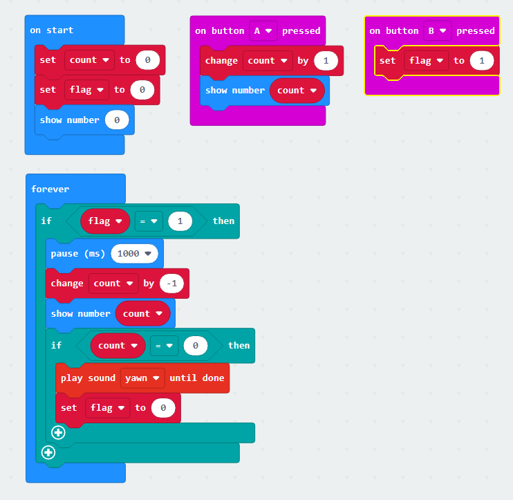

### 4.3.5 Connect Device and Download Program

(1) Connect the micro:bit to the computer's serial port with the USB cable.

(2) Click "**...**" button next to "**Download**" and select "**Connect Device**".

(3) Then click "**Pair**" in the pop-up interface.

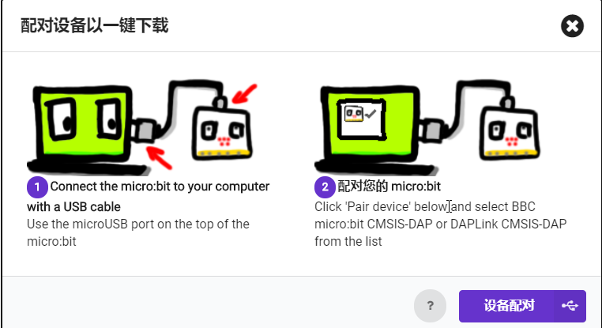

(4) Click "**Connect**".

(5) After the device is connected successfully, click "**Download**". The yellow indicator on the micro:bit near USB port will blink fast. At this time, do not disconnect or move USB cable to avoid failure download.

(6) After the download is completed, the indicator will stop blinking and keep lighting up. The interface will prompt "**Download completed**".

:::{Note}

There should only be two files in the micro:bit drive from beginning to end, as shown in the figure. The DETAILS.TXT file is used to record some parameters of the micro:bit and generally does not need to be concerned. The MICROBIT.HTM file is the official website page of the micro:bit. Clicking on this file requires the computer to be connected to the Internet.

:::

### 4.3.6 Project Outcome

After the program is downloaded, you can press button A three times, and then press button B to confirm. After 3 seconds, the buzzer will play music.

## 4.4 Play music

### 4.4.1 Getting Ready

(1) The position where the buzzer is located on the micro:bit.

(2) The positions where the buttons are located on the micro:bit.

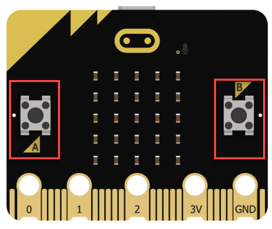

### 4.4.2 Learning Objective

Make the buttons on the micro:bi to enable the music playing through programming.

### 4.4.3 Project Logic

The micro:bit V2.0 has a built-in buzzer, which can be programmed to output sound.

In this lesson, different melodies can be set and triggered by pressing buttons A and B. This will achieve the effect of playing music.

### 4.4.4 Program Writing

- **Coding block combination**

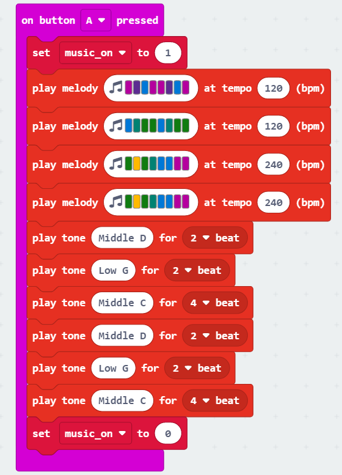

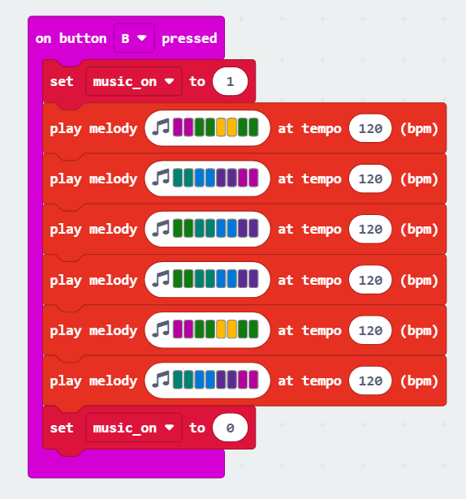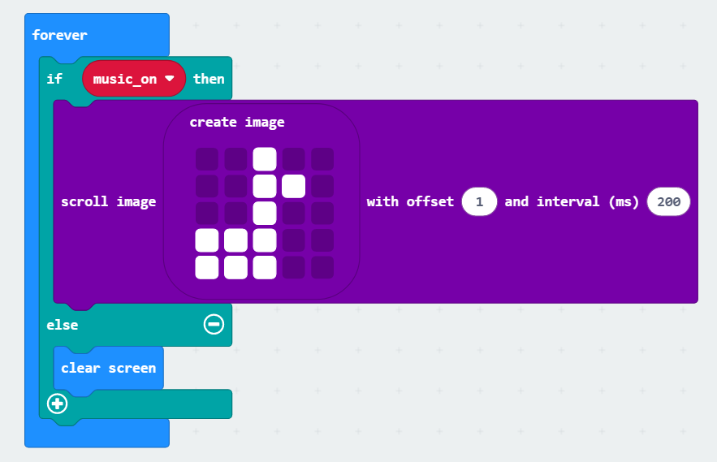

### 4.4.5 Connect Device and Download Program

(1) Connect the micro:bit to the computer's serial port with the USB cable.

(2) Click "**...**" button next to "**Download**" and select "**Connect Device**".

(3) Then click "**Pair**" in the pop-up interface.

(4) Click "**Connect**".

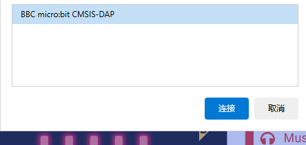

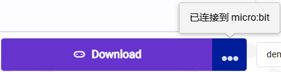

(5) After the device is connected successfully, click "**Download**". The yellow indicator on the micro:bit near USB port will blink fast. At this time, do not disconnect or move USB cable to avoid failure download.

(6) After the download is completed, the indicator will stop blinking and keep lighting up. The interface will prompt "**Download completed**".

:::{Note}

There should only be two files in the micro:bit drive from beginning to end, as shown in the figure. The DETAILS.TXT file is used to record some parameters of the micro:bit and generally does not need to be concerned. The MICROBIT.HTM file is the official website page of the micro:bit. Clicking on this file requires the computer to be connected to the Internet.

:::

### 4.4.6 Project Outcome

After the program is downloaded, pressing button A will play the melody of the song "Two Tigers", while pressing button B will play the melody of the song "Twinkle Twinkle Little Star".

## 4.5 Noise Detector

### 4.5.1 Getting Ready

(1) The position of the speaker on the micro:bit.

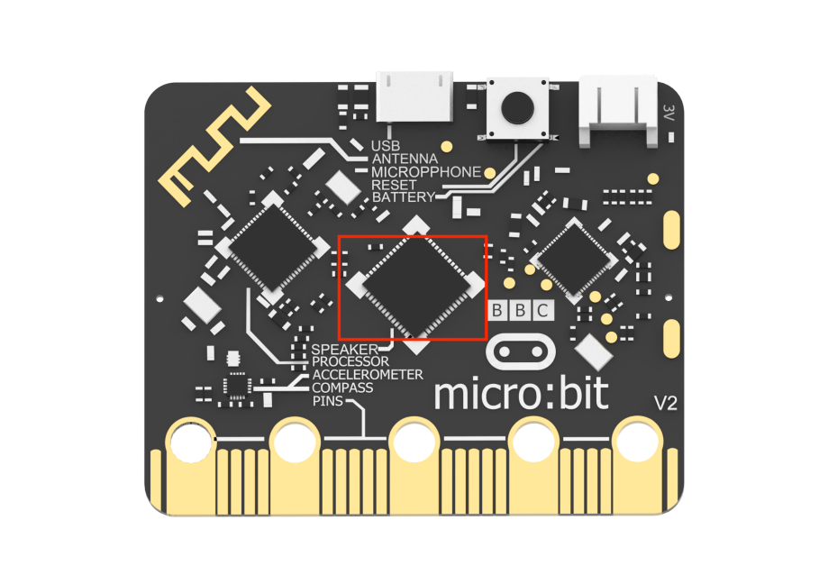

(2) The position of the microphone on the micro:bit.

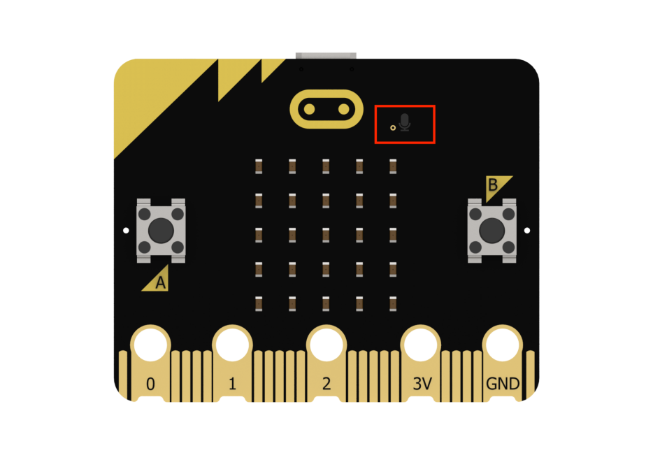

### 4.5.2 Learning Objective

(1) Learn about the microphone on the micro:bit and the relevant coding blocks.

(2) Implement sound detection and feedback through programming.

### 4.5.3 Project Logic

On the micro:bit V2.0, a microphone has been added to provide sound input.  When the microphone is activated, a red LED on the board will light up.

The environmental information, such as the ambient sound level, light intensity, and magnetic field strength, received by the micro:bit cannot be directly perceived or judged. However, specific values can be obtained through serial port printing.

For easier operation, let's redirect the serial port to the USB port in this lesson. Then, you can create a variable to represent the sound intensity and map the sound value range to the intensity value to display different images. When the sound level meets the set level, a sound alarm will be triggered.

### 4.5.4 Program Writing

- **Coding block learning**

|                       **Coding block**                       |                          **Class**                           |                         **Function**                         |
| :----------------------------------------------------------: | :----------------------------------------------------------: | :----------------------------------------------------------: |
|  |  | Indicate that the serial input and output use USB connection. |
|  |                                                              | Write the value and the newline character to the serial port. |
|  |  |     Omit the last several digits of the original value.      |

- **Coding block combination**

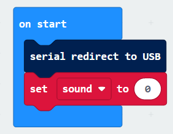

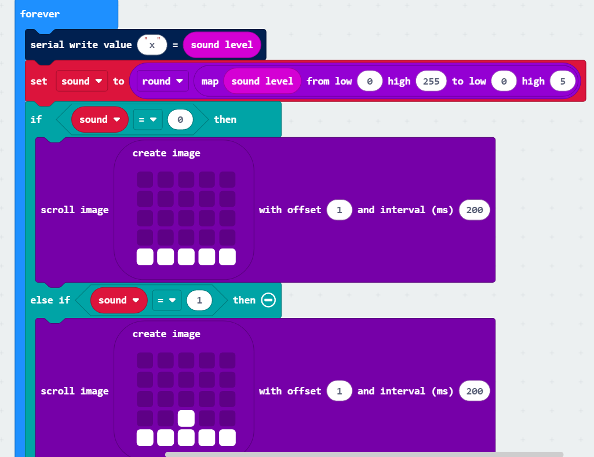

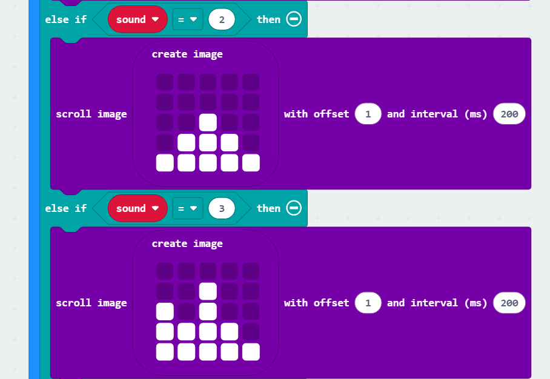

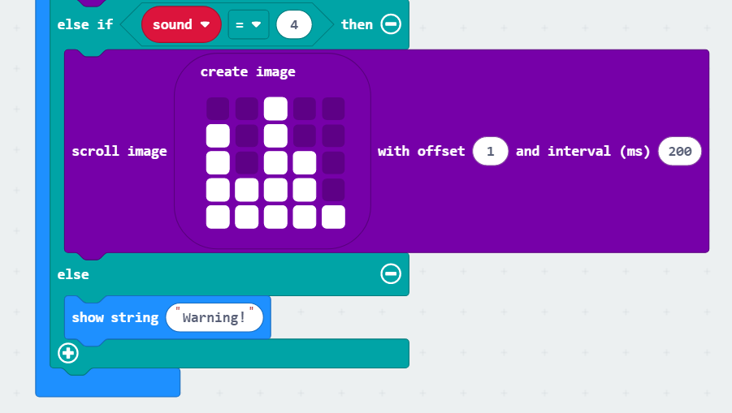

### 4.5.5 Connect Device and Download Program

(1) Connect the micro:bit to the computer's serial port with the USB cable.

(2) Click "**...**" button next to "**Download**" and select "**Connect Device**".

(3) Then click "**Pair**" in the pop-up interface.

(4) Click "**Connect**".

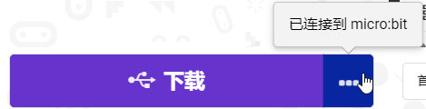

(5) After the device is connected successfully, click "**Download**". The yellow indicator on the micro:bit near USB port will blink fast. At this time, do not disconnect or move USB cable to avoid failure download.

(6) After the download is completed, the indicator will stop blinking and keep lighting up. The interface will prompt "**Download completed**".

:::{Note}

There should only be two files in the micro:bit drive from beginning to end, as shown in the figure. The DETAILS.TXT file is used to record some parameters of the micro:bit and generally does not need to be concerned. The MICROBIT.HTM file is the official website page of the micro:bit. Clicking on this file requires the computer to be connected to the Internet.

:::

### 4.5.6 Project Outcome

After the program is downloaded, you can speak to the microphone on the micro:bit. The LED dot matrix will display different high and low matrices to reflect the sound intensity, based on the detected sound level.

## 4.6 Night Alarming

### 4.6.1 Getting Ready

(1) The position of the LED dot matrix on the micro:bit.

(2) The position of the speaker on the micro:bit.

### 4.6.2 Learning Objective

① Learn about the LED dot matrix on the micro:bit with the function of the light sensor.

② Program micro:bit to detect light and feedback.

### 4.6.3 Project Logic

The micro:bit can enter the input mode by reversing the LED screen. The LED screen serves as a basic light sensor, which can be used to detect ambient light.  

In order to facilitate viewing the environmental information received by the micro:bit, we first print the light value through the serial port in the program and output it to the USB port. Then, set the condition based on the range of light values (0-255). When the light is dark enough, a sound prompt will be given.

### 4.6.4 Program Writing

- **Coding block learning**

|                       **Coding block**                       |                          **Class**                           |                         **Function**                         |
| :----------------------------------------------------------: | :----------------------------------------------------------: | :----------------------------------------------------------: |
|  |  | Indicate that the serial input and output use USB connection. |
|  |                                                              | Write the value and the newline character to the serial port. |
|  |  |     Omit the last several digits of the original value.      |

- **Coding block combination**

### 4.6.5 Connect Device and Download Program

(1) Connect the micro:bit to the computer's serial port with the USB cable.

(2) Click "**...**" button next to "**Download**" and select "**Connect Device**".

(3) Then click "**Pair**" in the pop-up interface.

(4) Click "**Connect**".

(5) After the device is connected successfully, click "**Download**". The yellow indicator on the micro:bit near USB port will blink fast. At this time, do not disconnect or move USB cable to avoid failure download.

(6) After the download is completed, the indicator will stop blinking and keep lighting up. The interface will prompt "**Download completed**".

:::{Note}

There should only be two files in the micro:bit drive from beginning to end, as shown in the figure. The DETAILS.TXT file is used to record some parameters of the micro:bit and generally does not need to be concerned. The MICROBIT.HTM file is the official website page of the micro:bit. Clicking on this file requires the computer to be connected to the Internet.

:::

### 4.6.6 Project Outcome

After the program is downloaded, the micro:bit can be moved to a dark place, and the LED dot matrix will display a moon pattern. The speaker will emit a prompt sound.

## 4.7 Compass

### 4.7.1 Getting Ready

The position of the electronic compass on the micro:bit.

### 4.7.2 Learning Objective

① Learn about the electronic compass on the micro:bit.

② Program micro:bit to detect direction and print the arrow.

### 4.7.3 Project Logic

There is an electronic compass on the micro:bit. It can measure the magnetic field strength in multiple directions, which can be realized through programming.

### 4.7.4 Program Writing

- **Coding block learning**

|                       **Coding block**                       |                          **Class**                           |                         **Function**                         |
| :----------------------------------------------------------: | :----------------------------------------------------------: | :----------------------------------------------------------: |
|  |  | Indicate the use of USB connection for serial input and output. |
|  |                                                              |      Write the value and line feed to the serial port.       |
|  |  |     Omit the last several digits of the original value.      |

- **Coding block combination**

### 4.7.5 Connect Device and Download Program

(1) Connect the micro:bit to the computer's serial port with the USB cable.

(2) Click "**...**" button next to "**Download**" and select "**Connect Device**".

(3) Then click "**Pair**" in the pop-up interface.

(4) Click "**Connect**".

(5) After the device is connected successfully, click "**Download**". The yellow indicator on the micro:bit near USB port will blink fast. At this time, do not disconnect or move USB cable to avoid failure download.

(6) After the download is completed, the indicator will stop blinking and keep lighting up. The interface will prompt "**Download completed**".

:::{Note}

There should only be two files in the micro:bit drive from beginning to end, as shown in the figure. The DETAILS.TXT file is used to record some parameters of the micro:bit and generally does not need to be concerned. The MICROBIT.HTM file is the official website page of the micro:bit. Clicking on this file requires the computer to be connected to the Internet.

:::

### 4.7.6 Project Outcome

:::{Note}

After the program is downloaded, the prompt "TILT TO FILL SCREEN" will be displayed by scrolling on the micro:bit. Then, you need to calibrate it. Hold the micro:bit and move it in different directions until all the LEDs of the dot matrix are lit up. 

:::

After calibration, hold the micro:bit to move it again, and the dot matrix will display the corresponding directional arrow.