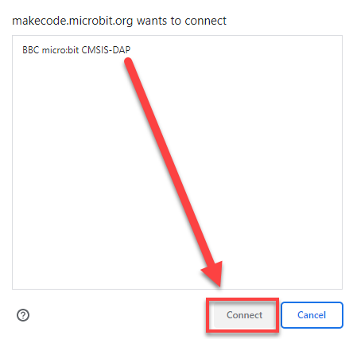
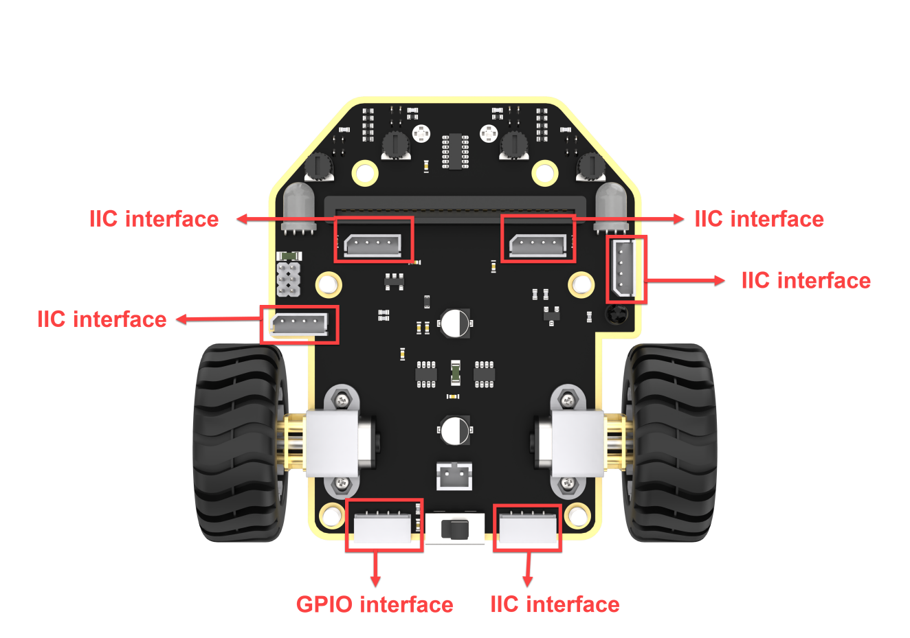
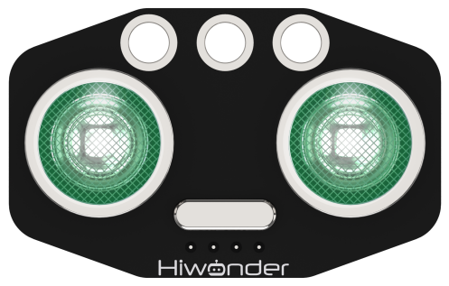
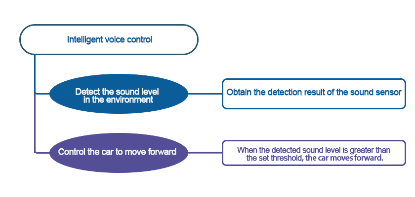
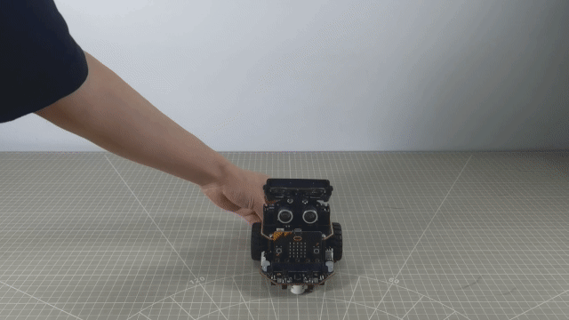
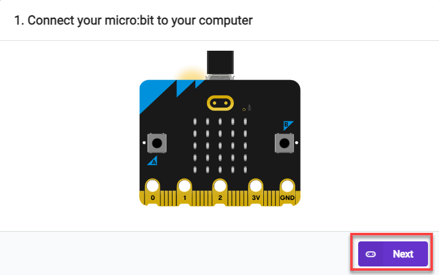
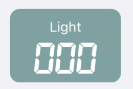
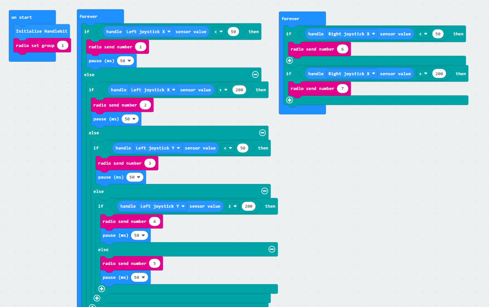

# 6. Basic Games Course

## 6.1 Straight-line Movement

The demonstration video in this section uses a top-down perspective as an example, and the content is equally applicable to other perspectives.

### 6.1.1 Getting Ready

In this program, set the value for the motors forward and reverse rotation by programming, thereby achieving straight-line movement.

Before starting, ensure that the batteries are fully charged and correctly installed in the car's battery slot. Do not reverse the positive and negative terminals.

### 6.1.2 Program Flowchart

### 6.1.3 Program Analysis

The following diagram is the main program:

First, when the car is powered on, it undergoes an initialization operation to ensure the subsequent program can execute correctly.

After waiting for 1 second, Motor 1 will rotate forward at a speed of 51, and Motor 2 will rotate forward at a speed of 60, lasting for 1 second.This achieves the effect of making the car move forward for 1 second. Motor speeds and time need to be adjusted based on actual conditions. If the car veers to the left, slightly increase the value of Motor 1 or decrease the value of Motor 2; if it veers to the right, do the opposite.

After moving forward for 1 second, there will be a 1-second pause, followed by moving backward for 1 second.

### 6.1.4 Program Download

[Straight-line Movement.hex](../_static/source_code/Programs.zip)

:::{Note}

When downloading the program, make sure to disconnect the power to the car. Otherwise, after downloading the program, the car may run the program directly, leading to potential falls.

:::

(1) Connect the micro:bit board to the computer using a USB data cable. In the editing interface, click **"Connect Device"** and follow the prompts to establish the connection.

(2) After a successful connection, click on the **"Download"** option at the bottom left of the page, and the program will be downloaded to the micro:bit board.

### 6.1.5 Gaming Experience

The car will move forward for 1 second at the set speed, then pause for one second, and subsequently move backward for one second.

## 6.2 Speed Control

:::{Note}

The demonstration video in this section uses a top-down perspective as an example, and the content is equally applicable to other perspectives.

:::

### 6.2.1 Getting Ready

In this program, set the value for the motors forward and reverse rotation by programming, thereby achieving straight-line movement.

Before starting, ensure that the batteries are fully charged and correctly installed in the car's battery slot. Do not reverse the positive and negative terminals.

### 6.2.2 Program Flowchart

### 6.2.3 Program Analysis

The following diagram is the main program:

First, The robot undergoes an initialization process as soon as it is powered on, setting the robot's initial speed to 0 to ensure the subsequent program can execute correctly.

Next, Motor 1 will rotate forward at a speed of 26, and Motor 2 will rotate forward at a speed of 30, allowing the robot to **move forward at a low speed** for 1 second. Then, after a stationary pause of 0.5 seconds, Motor 1 will reverse at a speed of -26, and Motor 2 will reverse at a speed of -30, causing the robot to **move backward at a low speed** for 1 second.

After that,Motor 1 will rotate forward at a speed of 60, and Motor 2 will rotate forward at a speed of 70, causing the robot to move forward at high speed for 1 second. Then, after a stationary pause of 0.5 seconds, Motor 1 will reverse at a speed of -60, and Motor 2 will reverse at a speed of -70, causing the robot to move backward at high speed for 1 second. Finally, the robot will come to a stop.

Note: When moving straight, the speeds of Motor 1 and Motor 2 should be adjusted based on the differential drive characteristics of your own car.

### 6.2.4 Program Download

[Speed Control.hex](../_static/source_code/Programs.zip)

:::{Note}

When downloading the program, make sure to disconnect the power to the car. Otherwise, after downloading the program, the car may run the program directly, leading to potential falls.

:::

(1) Connect the micro:bit board to the computer using a USB data cable. In the editing interface, click **"Connect Device"** and follow the prompts to establish the connection.

(2) After a successful connection, click on the **"Download"** option at the bottom left of the page, and the program will be downloaded to the micro:bit board.

### 6.2.5 Gaming Experience

The car will initially move forward at a low speed for 1 second, pause for 1 second, then move backward at a low speed for 1 second. After that, it will move forward quickly for 1 second, pause for 1 second, and finally move backward quickly for 1 second.

## 6.3 Buttons Control Turning

:::{Note}

The demonstration video in this section uses a top-down perspective as an example, and the content is equally applicable to other perspectives.

:::

### 6.3.1 Getting Ready

In this program, set the value for the motors forward and reverse rotation by programming, thereby achieving left and right turning.

Before starting, ensure that the batteries are fully charged and correctly installed in the car's battery slot. Do not reverse the positive and negative terminals.

### 6.3.2 Program Flowchart

### 6.3.3 Program Analysis

The following diagram is the main program:

First, when the car is powered on, it undergoes an initialization operation to ensure the subsequent program can execute correctly.

After pressing button "**A**", Motor 1 will rotate forward at a speed of 30, and Motor 2 will rotate backward at a speed of -20, lasting for 1 second. **Motor speeds and time need to be adjusted based on actual conditions.**

After pressing button "**B**", Motor 1 will rotate backward at a speed of -20, and Motor 2 will rotate forward at a speed of 30, lasting for 1 second. **Motor speeds and time need to be adjusted based on actual conditions.**

If the car veers to the left, you can slightly increase the value of motor 1 or decrease the value of motor 2; if it veers to the right, do the opposite.

### 6.3.4 Program Download

[Button Control Turning.hex](../_static/source_code/Programs.zip)

:::{Note}

When downloading the program, make sure to disconnect the power to the car. Otherwise, after downloading the program, the car may run the program directly, leading to potential falls.

:::

(1) Connect the micro:bit board to the computer using a USB data cable. In the editing interface, click **"Connect Device"** and follow the prompts to establish the connection.

(2) After a successful connection, click on the **"Download"** option at the bottom left of the page, and the program will be downloaded to the micro:bit board.

### 6.3.5 Gaming Experience

Pressing the **"A"** button on the board will cause the robot to turn right for 1 second at the set speed. Pressing the **"B"** will cause the robot to turn left for 1 second at the set speed.

## 6.4 Draw a Square

:::{Note}

The demonstration video in this section uses a top-down perspective as an example, and the content is equally applicable to other perspectives.

:::

### 6.4.1 Getting Ready

This program controls the car to move, achieving the trajectory of a square.

Before starting, ensure that the batteries are fully charged and correctly installed in the car's battery slot. Do not reverse the positive and negative terminals.

### 6.4.2 Program Flowchart

### 6.4.3 Program Analysis

The following diagram is the main program:

First, when the car is powered on, it undergoes an initialization operation to ensure the subsequent program can execute correctly.

Then, Motor 1 will rotate forward at a speed of 51, and Motor 2 will rotate forward at a speed of 60, allowing the robot to move forward continuously for 1 second. Next, Motor 1 will rotate forward at a speed of 40, and Motor 2 will rotate backward at a speed of -40, making the robot turn right for 0.6 seconds. This sequence will be repeated 4 times, creating a trajectory that draws a square.

Note: Due to different usage scenarios, values for motor and time settings need to be adjusted according to actual conditions. Otherwise, it may result in poor straight-line driving performance for the car. (In scenes with higher friction, you can increase the motor speed or extend the delay. With the same speed, the longer the pause time, the longer the distance traveled.)

### 6.4.4 Program Download

[Draw a Square.hex](../_static/source_code/Programs.zip)

:::{Note}

When downloading the program, make sure to disconnect the power to the car. Otherwise, after downloading the program, the car may run the program directly, leading to potential falls.

:::

(1) Connect the micro:bit board to the computer using a USB data cable. In the editing interface, click **"Connect Device"** and follow the prompts to establish the connection.

(2) After a successful connection, click on the **"Download"** option at the bottom left of the page, and the program will be downloaded to the micro:bit board.

### 6.4.5 Gaming Experience

The Nexbit will first move forward for 1 second at the set speed, then turn right for 0.6 seconds, repeating this 4 times. And the trajectory will draw a square.

## 6.5 Intelligent Line Following

### 6.5.1 Two-way Line Following

:::{Note}

The demonstration video in this section uses a top-down perspective as an example, and the content is equally applicable to other perspectives.

:::

* **Getting Ready**

This project determines whether the car deviates from the line by detecting whether the receivers of the two line followers receive reflected light.

Before starting, ensure that the batteries are fully charged and correctly installed in the car's battery slot. Do not reverse the positive and negative terminals.

* **Program Flowchart**

* **Module Introduction**

Identification and location of line-following sensors on the robot.

Each probe has an infrared transmitter and an infrared receiver. White reflects infrared strongly and black reflects infrared weakly. The output is larger when the infrared reflection is stronger (white), and smaller when the infrared emission is weaker (black).

* **Program Analysis**

(1) First, when the robot is powered on, initialize Nexbit.

(2) Then, the code will run in an infinite loop, and the line-following sensors will continuously perform detection. When Sensor 2 detects a white line and Sensor 3 detects a black line, it is determined that the car is deviating to the left. To adjust the car's direction of travel, the motors need to be controlled to turn the car to the right. In this case, the speed of Motor 1 needs to be set higher than Motor 2 to achieve a right turn.

(3) When Sensor 2 detects a black line and Sensor 3 detects a white line, it is determined that the car is deviating to the right. To adjust the car's direction of travel, the motors need to be controlled to turn the car to the left. In this case, the speed of Motor 1 needs to be set lower than Motor 2 to achieve a left turn.

* **Program Download**

[Two-way Line Following.hex](../_static/source_code/Programs.zip)

(1) Connect the micro:bit board to the computer using a USB data cable. In the editing interface, click **"Connect Device"** and follow the prompts to establish the connection.

:::{Note}

When downloading the program, make sure to disconnect the power to the car. Otherwise, after downloading the program, the car may run the program directly, leading to potential falls.

:::

(2) After a successful connection, click on the **"Download"** option at the bottom left of the page, and the program will be downloaded to the micro:bit board.

* **Gaming Experience**

The car will move forward along the planned route on the surface. If it deviates to the left or right of the line, it will adjust accordingly.

### 6.5.2 Four-way Line Following

:::{Note}

The demonstration video in this section uses a top-down perspective as an example, and the content is equally applicable to other perspectives.

:::

* **Getting Ready**

This project determines whether the car deviates from the line by detecting whether the receivers of the four line followers receive reflected light.

Before starting, ensure that the batteries are fully charged and correctly installed in the car's battery slot. Do not reverse the positive and negative terminals.

* **Program Flowchart**

* **Module Introduction**

Identification and location of line-following sensors on the robot.

Each probe has an infrared transmitter and an infrared receiver. White reflects infrared strongly and black reflects infrared weakly. The output is larger when the infrared reflection is stronger (white), and smaller when the infrared emission is weaker (black).

* **Program Analysis**

(1) First, when the robot is powered on, initialize Nexbit.

(2) Then, the code will run in an infinite loop, and the line-following sensors will continuously perform detection. When Sensor 1 and 2 detects a white line and Sensor 3 and 4 detects a black line, it is determined that the car is deviating to the left. To adjust the car's direction of travel, the motors need to be controlled to turn the car to the right. In this case, the speed of Motor 1 needs to be set higher than Motor 2 to achieve a right turn.

(3) When Sensor 1 and 2 detects a black line and Sensor 3 and 4 detects a white line, it is determined that the car is deviating to the right. To adjust the car's direction of travel, the motors need to be controlled to turn the car to the left. In this case, the speed of Motor 1 needs to be set lower than Motor 2 to achieve a left turn.

* **Program Download**

[Four-way Line Following.hex](../_static/source_code/Programs.zip)

(1) Connect the micro:bit board to the computer using a USB data cable. In the editing interface, click **"Connect Device"** and follow the prompts to establish the connection.

:::{Note}

When downloading the program, make sure to disconnect the power to the car. Otherwise, after downloading the program, the car may run the program directly, leading to potential falls.

:::

(2) After a successful connection, click on the **"Download"** option at the bottom left of the page, and the program will be downloaded to the micro:bit board.

* **Gaming Experience**

The car will move forward along the planned route on the surface. If it deviates to the left or right of the line, it will adjust accordingly.

## 6.6 Fall Prevention

The demonstration video in this section uses a top-down perspective as an example, and the content is equally applicable to other perspectives.

### 6.6.1 Getting Ready

Program the car to recognize the black line, reverse, and turn when detected.

Before starting, ensure that the batteries are fully charged and correctly installed in the car's battery slot. Do not reverse the positive and negative terminals.

### 6.6.2 Program Flowchart

### 6.6.3 Module Introduction

Identification and location of line-following sensors on the robot.

Each probe has an infrared transmitter and an infrared receiver. White reflects infrared strongly and black reflects infrared weakly. The output is larger when the infrared reflection is stronger (white), and smaller when the infrared emission is weaker (black).

### 6.6.4 Program Analysis

(1) Initialize the car program first, allowing the car to move forward while detecting its surroundings.

(2) If all four sensors detect a white line, it means that there is no danger of falling ahead, and the robot can proceed forward.

(3) If sensor 1 detects a black line while sensor 4 does not, it indicates that there is a danger of falling ahead. The robot will reverse, make a slight right turn, and then recheck for forward movement.

(4) If sensor 4 detects a black line while sensor 1 does not, it indicates that there is a danger of falling ahead. The robot will reverse, make a slight left turn, and then recheck for forward movement.

### 6.6.5 Program Download

[Fall Prevention.hex](../_static/source_code/Programs.zip)

(1) Connect the micro:bit board to the computer using a USB data cable. In the editing interface, click **"Connect Device"** and follow the prompts to establish the connection.

:::{Note}

When downloading the program, make sure to disconnect the power to the car. Otherwise, after downloading the program, the car may run the program directly, leading to potential falls.

:::

(2) After a successful connection, click on the **"Download"** option at the bottom left of the page, and the program will be downloaded to the micro:bit board.

### 6.6.6 Gaming Experience

The robot will move forward in a straight line on the plane. When it encounters a black line, the robot will quickly move backward, then make a left turn before resuming forward straight-line movement.

##  6.7 Ultrasonic Ranging

The demonstration video in this section uses a top-down perspective as an example, and the content is equally applicable to other perspectives.

### 6.7.1 Getting Ready

This project uses the ultrasonic sensor to detect the distance of the obstacle via programming. The result will be displayed on the micro:bit's LED matrix.

Before starting, ensure that the batteries are fully charged and correctly installed in the car's battery slot. Do not reverse the positive and negative terminals.

### 6.7.2 Program Flowchart

### 6.7.3 Module Introduction

The module automatically sends 8 square waves of 40kHz when measuring distance, and then checks for signal returns. If a signal is returned, it outputs a high level, and the duration of the high level is the time taken for the ultrasonic wave to travel from transmission to return.

The specific formula is: Distance = (High-Level Time \* Speed of Sound (340m/s)) / 2.

Connect the ultrasonic sensor to any I2C interface on the robot.

### 6.7.4 Program Analysis

(1) First, when the car is powered on, the two LED lights on the ultrasonic sensor will be displayed in red.

(2) Then, the ultrasonic sensor will detect the distance of the obstruction in front every 100 milliseconds and display it on the dot matrix module.

### 6.7.5 Program Download

[Ultrasonic Raging.hex](../_static/source_code/Programs.zip)

(1) Connect the micro:bit board to the computer using a USB data cable. In the editing interface, click **"Connect Device"** and follow the prompts to establish the connection.

(2)  After a successful connection, click on the **"Download"** option at the bottom left of the page, and the program will be downloaded to the micro:bit board.

### 6.7.6 Gaming Experience

When using your palm or another object to obstruct the ultrasonic sensor in front of the micro:bit, the dot matrix will display the distance from the obstruction to the robot **in centimeters**.

## 6.8 Ultrasonic Obstacle Avoidance 

:::{Note}

The demonstration video in this section uses a top-down perspective as an example, and the content is equally applicable to other perspectives.

:::

### 6.8.1 Getting Ready

Achieve obstacle-avoidance movement for the Nexbit by programming, utilizing the combination of ultrasonic sensor and motors.

Before starting, ensure that the batteries are fully charged and correctly installed in the car's battery slot. Do not reverse the positive and negative terminals.

### 6.8.2 Program Flowchart

### 6.8.3 Module Introduction

The module automatically sends 8 square waves of 40kHz when measuring distance, and then checks for signal returns. If a signal is returned, it outputs a high level, and the duration of the high level is the time taken for the ultrasonic wave to travel from transmission to return.

The specific formula is: Distance = (High-Level Time \* Speed of Sound (340m/s)) / 2.

Connect the ultrasonic sensor to any I2C interface on the robot.

### 6.8.4 Program Analysis

[Ultrasonic Obstacle Avoidance.hex](../_static/source_code/Programs.zip)

(1) Initially, when the car is powered on, the distance to the obstacle detected by the ultrasonic sensor is stored in the **"distance"** variable. Then, the program checks the value of the **"distance"** variable. If it is less than 200 but greater than 0, it indicates that the distance between the obstacle and the car is less than 20cm. At this point, the ultrasonic sensor illuminates a red light, the car stops moving forward, and then turns right by a specified angle. The code is as follows:

(2) The micro:bit LED matrix module displays in real-time the distance measured by the ultrasonic sensor. The code is as follows:

(3) Continuously obtain distance measurements from the ultrasonic sensor. When the value of the **"distance"** variable is greater than 200, indicating a distance greater than 20cm, the ultrasonic sensor illuminates a blue light, and the car moves forward.

The whole code is as follows:

### 6.8.5 Program Download

(1) Connect the micro:bit board to the computer using a USB data cable. In the editing interface, click **"Connect Device"** and follow the prompts to establish the connection.

:::{Note}

When downloading the program, make sure to disconnect the power to the car. Otherwise, after downloading the program, the car may run the program directly, leading to potential falls.

:::

(2) After a successful connection, click on the **"Download"** option at the bottom left of the page, and the program will be downloaded to the micro:bit board.

### 6.8.6 Gaming Experience

After the car is powered on, if there is an obstacle in front at a distance greater than 200mm, the ultrasonic sensor will illuminate a blue light, and the car will move forward in a straight line. When the distance to the obstacle in front is detected to be less than 200mm, it will illuminate a red light and stop moving forward. Afterward, it will turn right by a specified angle and continue moving forward.

## 6.9 Breathing LED

:::{Note}

The demonstration video in this section uses a top-down perspective as an example, and the content is equally applicable to other perspectives.

:::

### 6.9.1 Getting Ready

This project uses the onboard RGB lights to achieve the effect of a breathing LED.

Before starting, ensure that the batteries are fully charged and correctly installed in the car's battery slot. Do not reverse the positive and negative terminals.

### 6.9.2 Program Flowchart

### 6.9.3 Module Introduction

On the bottom of the car chassis, there are two RGB lights on each side, located as follows:

Principle of RGB Color Illumination: RGB lights achieve color variation by adjusting the brightness of the three colors - red (R), green (G), and blue (B). Therefore, we can control the display of different colors by adjusting the values of the RGB.

### 6.9.4 Program Analysis

(1) Initially, when the robot is powered on, set the brightness of the RGB lights and assign values to variables. The code is as follows:

(2) Set a variable for the brightness of the RGB lights, and use a loop to increase and decrease it, creating a cycling on-off effect for the RGB lights.

(3) Achieve color variation in the onboard RGB lights through the **'color'** variable.

:::{Note}

The color settings for the onboard RGB lights on both sides of the car are different from the ultrasonic sensor. The ultrasonic sensor can have a wide range of colors since it adjusts the values of a specific channel in the RGB scheme. On the other hand, the RGB lights themselves have only nine fixed colors, each set with values from 1 to 9.

:::

### 6.9.5 Program Download

[Breathing LED.hex](../_static/source_code/Programs.zip)

(1) Connect the micro:bit board to the computer using a USB data cable. In the editing interface, click **"Connect Device"** and follow the prompts to establish the connection.

(2) After a successful connection, click on the **"Download"** option at the bottom left of the page, and the program will be downloaded to the micro:bit board.

### 6.9.6 Gaming Experience

After the robot is powered on, the RGB lights on both sides of the chassis breathe continuously, transitioning through different colors and gradually increasing in brightness.

## 6.10 Glowing Line Following

:::{Note}

The demonstration video in this section uses a top-down perspective as an example, and the content is equally applicable to other perspectives.

:::

### 6.10.1 Getting Ready

This project make the car light up the RGB lights while performing line-following via programming.

Before starting, ensure that the batteries are fully charged and correctly installed in the car's battery slot. Do not reverse the positive and negative terminals.

### 6.10.2 Program Flowchart

### 6.10.3 Module Introduction

The chassis has 4 line follower probes at the bottom. Each probe has an infrared transmitter and an infrared receiver.

When the infrared light emitted by the transmitter encounters a white surface, it will be reflected back to the receiver, while it will be absorbed when it encounters a black surface. Therefore, this module determines whether the car deviates from the line by detecting whether the receiver receives reflected light.

Before starting, you need to map out a black line on a flat surface (the surface color is recommended to be white or another light color to avoid affecting the line-following performance). Then, based on the scene, adjust the sensitivity of the line-following sensors. **(In this lesson, we need to adjust all 4 sensors, and the adjustment process is the same for other sensors.The following example is based on Sensor 2.)**

The specific method is as follows:

(1) Place the line-following sensor probe directly above the black line in the scene.

(2) Adjust the knob so that the LED light at the top of the sensor just goes out. If the LED light remains lit when the sensor probe is placed outside of the line at this point, then the adjustment is complete.

### 6.10.4 Program Analysis

(1) First, initialize Nexbit, and set the initial value of 'color' to 1.

(2) Make the LED lights cycle through different colors.

(3) Line-following: When sensor 1 or 2 detects a black line, the car turns right; when sensor 3 or 4 detects a black line, the car turns left.

### 6.10.5 Program Download

[Glowing Line Following.hex](../_static/source_code/Programs.zip)

(1) Connect the micro:bit board to the computer using a USB data cable. In the editing interface, click **"Connect Device"** and follow the prompts to establish the connection.

:::{Note}

When downloading the program, make sure to disconnect the power to the car. Otherwise, after downloading the program, the car may run the program directly, leading to potential falls.

:::

(2) After a successful connection, click on the **"Download"** option at the bottom left of the page, and the program will be downloaded to the micro:bit board.

### 6.10.6 Gaming Experience

The car will follow a line on a flat surface, illuminating the colored lights in a continuous loop.

## 6.11 Intelligent Voice Control

:::{Note}

The demonstration video in this section uses a top-down perspective as an example, and the content is equally applicable to other perspectives.

:::

### 6.11.1 Getting Ready

In this project, program the robot to move straight upon receiving sound.

Before starting, ensure that the batteries are fully charged and correctly installed in the car's battery slot. Do not reverse the positive and negative terminals.

### 6.11.2 Program Flowchart

### 6.11.3 Module Introduction

The sound sensor is located on the micro:bit board.

It can detect the sound level in the environment and convert it into a value ranging from 0 to 255. The maximum volume is 255.

### 6.11.4 Program Analysis

The following diagram is the main program:

First, to ensure the subsequent program can execute correctly the robot will undergo an initialization process as soon as it is powered on.

Next, it will make a judgment to check if the surrounding sound reaches the preset threshold (by default, the program is set to 100). If the ambient sound is greater than this value, it will perform further checks to ensure accuracy.

Once it confirms the detection of sound greater than the set threshold, the robot will emit a short beep. After that, it will control both motor 1 and motor 2 to rotate forward at a speed of 40 for 1 second. Finally, it will come to a stop and proceed to the next round of evaluation.

The motor speed and time need to be set based on the actual situation.

### 6.11.5 Program Download

[Intelligent Voice Control.hex](../_static/source_code/Programs.zip)

(1) Connect the micro:bit board to the computer using a USB data cable. In the editing interface, click **"Connect Device"** and follow the prompts to establish the connection.

:::{Note}

When downloading the program, make sure to disconnect the power to the car. Otherwise, after downloading the program, the car may run the program directly, leading to potential falls.

:::

(2) After a successful connection, click on the **"Download"** option at the bottom left of the page, and the program will be downloaded to the micro:bit board.

### 6.11.6 Gaming Experience

When the sound sensor on the board detects a sound level greater than 100, the buzzer will emit a short beep. Following this, the motors on the robot will rotate at a preset speed, causing the robot to move forward. After 1 second, the robot will come to a stop.

## 6.12 Buzzer Control

:::{Note}

The demonstration video in this section uses a top-down perspective as an example, and the content is equally applicable to other perspectives.

:::

### 6.12.1 Getting Ready

In this project, program the robot to switch music via the buttons.

Before starting, ensure that the batteries are fully charged and correctly installed in the car's battery slot. Do not reverse the positive and negative terminals.

### 6.12.2 Program Flowchart

### 6.12.3 Module Introduction

There are two buttons labeled **"A"** and **"B,**" as well as a buzzer. Through programming, you can control the board to play and switch music according to the settings. The buzzer is located as follows:

### 6.12.4 Program Analysis

The following diagram is the main program:

Upon startup, the volume of the board buzzer will be set, and a variable named **"num"** will be initialized with a value of 1. In subsequent program blocks, this variable will be displayed and invoked.

Next is through conditional statements to modify the displayed number when buttons are pressed. When button **"A"** is pressed, the displayed number on the board will decrease by 1. If the number is 1 and button **"A"** is pressed, it will count down from 4 and correspondingly jump to 3. The same logic applies to button **"B,"** increasing the number. When the number is 3 and button **"B"** is pressed, it will count up from 0 and correspondingly jump to 1.

Finally, the invocation of the number is implemented. When the displayed number is 1, the board buzzer will play **"Happy Birthday"**; for number 2, it will play **"Wedding"**; and for number 3, it will play **"The song of Joy."**

### 6.12.5 Program Download

[Buzzer Control.hex](../_static/source_code/Programs.zip)

(1) Connect the micro:bit board to the computer using a USB data cable. In the editing interface, click **"Connect Device"** and follow the prompts to establish the connection.

(2) After a successful connection, click on the **"Download"** option at the bottom left of the page, and the program will be downloaded to the micro:bit board.

### 6.12.6 Gaming Experience

When powered on, the buzzer on the board will play **"Happy Birthday,"** and the dot matrix model on the board will display the number "**1**." When the **"A"** or **"B"** button on the board is pressed, the number and music will switch accordingly. The played music and their corresponding numbers are as follows:

| **Number** | **Music**      |
| ---------- | -------------- |
| 1          | Happy Birthday |
| 2          | Wedding        |
| 3          | Song of joy    |

## 6.13 Gravity Control

:::{Note}

The demonstration video in this section uses a top-down perspective as an example, and the content is equally applicable to other perspectives.

:::

### 6.13.1 Getting Ready

In this project, program the car to implement gravity control.

Before starting, ensure that the batteries are fully charged and correctly installed in the car's battery slot. Do not reverse the positive and negative terminals.

### 6.13.2 Program Flowchart

### 6.13.3 Module Introduction

Working principle of the acceleration sensor: When the micro:bit is at rest or in uniform motion, the accelerometer detects only the acceleration due to gravity.

When the micro:bit is gently shaken, the accelerometer detects an acceleration much smaller than the gravitational acceleration, which can be ignored. Therefore, when using the micro:bit, the main focus is on detecting changes in the orientation, specifically changes in gravitational acceleration along the x, y, and z axes, and applying them accordingly.

### 6.13.4 Program Analysis

(1) First, initialize Nexbit and variables, setting the initial posture of the car to stop.

(2) In an infinite loop, if the variable value of **"step"** is 0, it indicates the acceleration detection stage. First, check if the acceleration in the y-axis is greater than 900, indicating that the car is in a horizontal state. Then, check the acceleration values. When **"x \> 1050,"** it means the car is **turning left**; when **"x \< -1080,"** it means the car is **turning right**; when **"z \> 1050,"** it means the car is **moving forward**; when **"z \< -1050,"** it means the car is **moving backward**.

(3) If the variable value of **"step"** is 1, it indicates that the detection is complete. You can then use the value of the **"status"** variable to determine which part of the program to execute.

| **Status** |  **Action**  | **Status** |  **Action**   |
| :--------: | :----------: | :--------: | :-----------: |
|     1      |  Turn left   |     2      |  Turn right   |
|     3      | Move forward |     4      | Move backward |

The code is shown as below:

### 6.13.5 Program Download

[Gravity Control.hex](../_static/source_code/Programs.zip)

[Serial print (microbit).hex](../_static/source_code/Programs.zip)

(1) Connect the micro:bit board to the computer using a USB data cable. In the editing interface, click **"Connect Device"** and follow the prompts to establish the connection.

:::{Note}

When downloading the program, make sure to disconnect the power to the car. Otherwise, after downloading the program, the car may run the program directly, leading to potential falls.

:::

(2) After a successful connection, click on the **"Download"** option at the bottom left of the page, and the program will be downloaded to the micro:bit board.

### 6.13.6 Gaming Experience

After the car is powered on, place it horizontally. Then, gently shake the car in a certain direction. At this point, the dot matrix module will display an arrow pointing in the direction of the shake, and the car will move in that direction.

## 6.14 Touch Control

:::{Note}

The demonstration video in this section uses a top-down perspective as an example, and the content is equally applicable to other perspectives.

:::

### 6.14.1 Getting Ready

When the logo is touched, the car will move straight.

Before starting, ensure that the batteries are fully charged and correctly installed in the car's battery slot. Do not reverse the positive and negative terminals.

### 6.14.2 Program Flowchart

### 6.14.3 Working Principle

There is a touch sensor on the micro:bit at the logo position.

### 6.14.4 Program Analysis

The following diagram is the main program:

First, when the car is powered on, it will go through an initialization process to ensure the subsequent program can run smoothly.

Next, when the logo is touched, the car moves backward at a speed of 40, and after a delay of 500ms, the motors stop.

### 6.14.5 Program Download

[Touch Control.hex](../_static/source_code/Programs.zip)

(1) Connect the micro:bit board to the computer using a USB data cable. In the editing interface, click **"Connect Device"** and follow the prompts to establish the connection.

:::{Note}

When downloading the program, make sure to disconnect the power to the car. Otherwise, after downloading the program, the car may run the program directly, leading to potential falls.

:::

(2) After a successful connection, click on the **"Download"** option at the bottom left of the page, and the program will be downloaded to the micro:bit board.

### 6.14.6 Gaming Experience

Touching the logo will make the car move backward for a certain distance and then stop. 

:::{Note}

The car will move backward immediately after being touched, so please ensure that there are no obstacles behind the car and it is not near the edge of a surface.

:::

## 6.15 App Control

The demonstration video in this section uses a top-down perspective as an example, and the content is equally applicable to other perspectives.

### 6.15.1 Getting Ready

This project demonstrates how to control the car to move via app.

Before starting, ensure that the batteries are fully charged and correctly installed in the car's battery slot. Do not reverse the positive and negative terminals.

:::{Note}

Android/iOS users can go to the same path in this document or the appendix to find the mobile app installation package for download and installation.

:::

### 6.15.2 Program Flowchart

### 6.15.3 Module Introduction

There are a Bluetooth antenna on the micro:bit board.

### 6.15.4 Program Analysis

(1) First, when the car is powered on, it will undergo initialization operations, including displaying patterns on the matrix module after initialization is complete, and indicating connection success or failure on the matrix module.

(2) Establish a Bluetooth connection and read firmware information. Then, identify the command type and perform corresponding operations for different command types.

### 6.15.5 Program Download

[App Control.hex](../_static/source_code/Programs.zip)

:::{Note}

When downloading the program, make sure to disconnect the power to the car. Otherwise, after downloading the program, the car may run the program directly, leading to potential falls.

:::

(1) Connect the micro:bit board to the computer using a USB data cable. In the editing interface, click **"Connect Device"** and follow the prompts to establish the connection.

(2) After a successful connection, click on the **"Download"** option at the bottom left of the page, and the program will be downloaded to the micro:bit board.

### 6.15.6 Gaming Experience

* **APP Connection**

:::{Note}

* Before using the app, please enable Bluetooth and location services in the phone settings.
* Use the Bluetooth button within the Wonderbit app to pair and connect with the device. Do not pair through the phone settings using a passkey.

:::

The specific steps are as follows:

(1) Enable Bluetooth and location services on the phone.

(2) Open the Wonderbit APP, click on the three horizontal bars in the popped-up main interface, and switch the device to **"Nexbit"**.

(3) Click on the Bluetooth connection icon in the upper right corner of the app, and in the popped-up device search interface, click on the upper right device list. Select the Bluetooth with the name **"BBC micro:bit"** to establish a connection.

* **App Operation**

The main interface is shown below:

The corresponding button descriptions are shown in the following table:

| **Icon**                                                     | **Function**                                                 |
| ------------------------------------------------------------ | ------------------------------------------------------------ |
 | Control Nexbit to move forward, backward, and turn.          |
 | Display the light intensity at Nexbit's current location.    |
 | Display the distance from the ultrasonic sensor on Nexbit to an object in front of it. |
 | Display the temperature at Nexbit's current location.        |
 | Activate this button, and the two colored lights on Nexbit will display random colors within a certain range. |
 | Activate this button, and the colored lights will turn on. Turn off the switch, and the lights will turn off. |
 | Activate this button, and Nexbit can be moved through gravity sensing. |
 | Control the color of Nexbit's lights through the slider knob. |

Detailed function instructions of mechanical claw are in [8. Mechanical Claw Control Course ->8.4 APP Remote Handling](8.Mechanical_claw_control_course.md#app-remote-handling).

| **Icon**                                                     | **Function**                                          |
| ------------------------------------------------------------ | ----------------------------------------------------- |
 | Control servo 1 to open or close the mechanical claw. |

## 6.16 Infrared Remote Control

:::{Note}

The demonstration video in this section uses a top-down perspective as an example, and the content is equally applicable to other perspectives.

:::

### 6.16.1 Getting Ready

Program the robot to operate upon receiving remote control commands.

Before starting, ensure that the batteries are fully charged and correctly installed in the car's battery slot. Do not reverse the positive and negative terminals.

### 6.16.2 Program Flowchart

### 6.16.3 Module Introduction

There is an infrared receiver on the micro:bit board. When you use an infrared remote control to press the corresponding button, the robot will receive the message and then execute the command.

When using infrared remote control, try to align it with the infrared receiver, otherwise, it may not receive the signal.

### 6.16.4 Program Analysis

The following diagram is the main program:

Upon powering on, the robot undergoes an initialization process. Two initial variables, **"angle"** and **"step"** are set, along with two flags, **"Aflag"** and **"Bflag"**.

If the user presses a set button, such as the forward direction key, the robot's motor 1 will move forward at a speed of 50, and motor 2 will move forward at a speed of 55.

If the button A to change the servo motor is pressed, the **"Aflag"** will be triggered. In this case, the mechanical claw will check its current position, which is the initial value of **"angle"**. It will then increment the angle by 2 units each time, corresponding to the action of opening the claw.

### 6.16.5 Program Download

[Infrared Remote Control.hex](../_static/source_code/Programs.zip)

(1) Connect the micro:bit board to the computer using a USB data cable. In the editing interface, click **"Connect Device"** and follow the prompts to establish the connection.

:::{Note}

When downloading the program, make sure to disconnect the power to the car. Otherwise, after downloading the program, the car may run the program directly, leading to potential falls.

:::

(2) After a successful connection, click on the **"Download"** option at the bottom left of the page, and the program will be downloaded to the micro:bit board.

### 6.16.6 Gaming Experience

The infrared remote control mainly consists of the following buttons: forward, backward, left turn, right turn, as well as the opening and closing of the mechanical claw, and the midpoint, as shown in the following diagram:

:::{Note}

Before using the infrared remote control, make sure to remove the insulation paper. Additionally, natural light may affect the infrared remote control, so it is recommended to use it in an indoor environment.

:::

## 6.17 Handlebit Handle Control

:::{Note}

The demonstration video in this section uses a top-down perspective as an example, and the content is equally applicable to other perspectives.

:::

### 6.17.1 Getting Ready

This project controls the cars movement via the Handlebit handle.

Before starting, ensure that the batteries are fully charged and correctly installed in the car's battery slot. Do not reverse the positive and negative terminals.

### 6.17.2 Program Flowchart

### 6.17.3 Module Introduction

The micro:bit board comes with a built-in wireless transmission and reception module. You only need to invoke its module to achieve wireless data transmission.

The position of Bluetooth transmission on the micro:bit, as shown in the diagram:

Each button on the Handlebit handle corresponds to a number, and when pressed, this number can be wirelessly transmitted. When the robot receives this number, you can write corresponding execution statements. This way, through this "**two-way**" communication, wireless transmission and control are achieved.

### 6.17.4 Program Analysis

The following diagram is the main program of sender:

The following diagram is the main program of receiver:

:::{Note}

Due to different usage scenarios, values for motor and time settings need to be adjusted based on the actual conditions.

:::

Firstly, the transmitter, which is the program for our Handlebit wireless controller, performs initialization during startup. At the same time, it sets the wireless transmission group, with the default being group 1. The subsequent receiver must also be set to group 1 to receive wireless messages sent by the transmitter.

Next is the definition of the buttons that the handle will use. For example, when we move the joystick, the micro:bit board will calculate the X and Y values of the joystick. When moved to a certain extent, it will then emit the corresponding signal.

Then, moving on to the receiver, similarly, the receiver will first perform initialization operations on the robot. It will set the wireless group to 1 so that both sides can establish a connection. After that, it will set initial variables for the subsequent control of the claw servo motor.

Upon receiving messages from the transmitter, the receiver will execute the corresponding actions. For instance, if it receives message number 3, indicating that the joystick is pushed backward, the corresponding action would be the car moving backward. You can experience other specific actions after downloading the program.

### 6.17.5 Program Download

[Nexbit-Receiver.hex](../_static/source_code/Programs.zip)

[Handlebit-Sender.hex](../_static/source_code/Programs.zip)

(1) Connect the micro:bit board to the computer using a USB data cable. In the editing interface, click **"Connect Device"** and follow the prompts to establish the connection.

:::{Note}

When downloading the program, make sure to disconnect the power to the car. Otherwise, after downloading the program, the car may run the program directly, leading to potential falls.

:::

() After a successful connection, click on the **"Download"** option at the bottom left of the page, and the program will be downloaded to the micro:bit board.

### 6.17.6 Gaming Experience

When both micro:bit boards have downloaded their respective programs and are plugged into the handle and robot, the handle sends out commands, and the robot, upon receiving the wireless data, will execute the corresponding actions.

