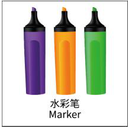
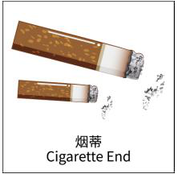
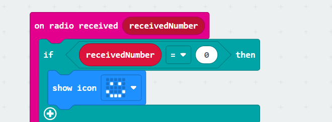
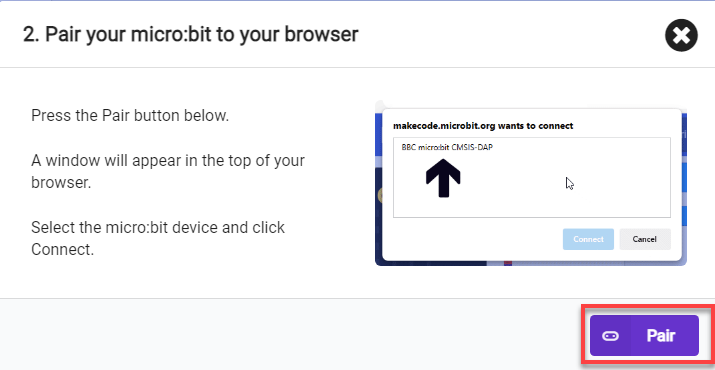

# 7. AI Vision Game

## 7.1 Facial Recognition

:::{Note}

* This game is recommended in well-lit environments, but avoid direct sunlight.

* It is recommended to use the forward-facing posture.

:::

### 7.1.1 Getting Ready

Connect the WonderCam Vision Module to the car, enabling face recognition. This allows the car to have different feedback effects on the dot matrix and RGB lights when different faces are recognized.

Before starting, ensure that the batteries are fully charged and correctly installed in the car's battery slot. Do not reverse the positive and negative terminals.

### 7.1.2 Program Flowchart

### 7.1.3 Module Introduction

The user-friendly WonderCam vision module can complete AI training with just one click. It can directly output recognition results to the controller, making it easy to implement various AI visual creative projects.

Connect the WonderCam Vision Module to any I2C interface on the robot.

Adjust the WonderCam Vision Module to the forward-facing position, as shown in the following picture:

### 7.1.4 Program Analysis

(1) After downloading the program and starting the robot, the robot will first undergo initialization. This includes initializing the address of WonderCam, setting up functions, and initializing variables with preset values. Set **"Error Face Count"** and **"No Face Count"** to 0, and turn off the melody.

(2) Next, WonderCam will continuously obtain recognition results and make judgments. When a face is recognized, it will further check whether it is a face that has been previously taught. If it is, the variable **"Error Face Count"** will be set to 0, and the **"No Face Count"** will be set to 5. The next step involves checking the **"No Face Count"** and playing a set melody while displaying a smiling pattern.

(3) When the **"No Face Count"** is set to 5, the program will control the RGB LED to continuously blink in different colors every 100 milliseconds.

(4) If a recognized face is not the learned face, the variable **"Error Face Count"** will be incremented. When this variable reaches 4, a crying pattern will be displayed.

Then, it will control motor 1 to turn left at a speed of -60 and motor 2 to turn right at a speed of 60 for 0.15 seconds. Following that, it will control motor 1 to turn right at a speed of 60 and motor 2 to turn left at a speed of -60 for 0.15 seconds. This sequence of operations will be repeated four times.

(5) After completing the above operations, the robot will return to the recognition state, waiting for facial recognition again.

### 7.1.5 Program Download

[Facial Recognition.hex](../_static/source_code/Programs.zip)

(1) Connect the micro:bit board to the computer using a USB data cable. In the editing interface, click **"Connect Device"** and follow the prompts to establish the connection.

:::{Note}

When downloading the program, make sure to disconnect the power to the car. Otherwise, after downloading the program, the car may run the program directly, leading to potential falls.

:::

(2) After a successful connection, click on the **"Download"** option at the bottom left of the page, and the program will be downloaded to the micro:bit board.

### 7.1.6 Gaming Experience

Start the game, then proceed to teach the robot to recognize a face with the ID of 1 using the WonderCam Vision Recognition Module. When a face is recognized, the robot will play a melody, and the dot matrix module on the board will display a smiling face.

If a face is recognized, but it doesn't match the learned face (ID 1), the robot will twist in place, indicating that the correct face has not been recognized.

:::{Note}

For learning about facial recognition, you can go to [7. AI Vision Game/7.1 Facial Recognition](#anchor_7_1) for study.

## 7.2 Landmark Recognition

:::{Note}

Due to the use of the visual module in this game, make sure to recognize a background with white (or other light-colored) surfaces. Ensure good lighting conditions for recognition; otherwise, it may affect recognition results.

:::

### 7.2.1 Getting Ready

Connect the WonderCam Vision Module to the car, enabling landmark recognition. This allows the car to move in different directions when recognizing different road signs.

Before starting, ensure that the batteries are fully charged and correctly installed in the car's battery slot. Do not reverse the positive and negative terminals.

### 7.2.2 Program Flowchart

### 7.2.3 Module Introduction

The user-friendly WonderCam vision module can complete AI training with just one click. It can directly output recognition results to the controller, making it easy to implement various AI visual creative projects.

Connect the WonderCam Vision Module to any I2C interface on the robot.

Adjust the WonderCam Vision Module to the forward-facing position, as shown in the following picture:

### 7.2.4 Program Analysis

(1) After starting the robot, it will undergo initialization operations, including turning off the RGB LED on the robot to avoid interference. At the same time, set the address of the WonderCam Vision Module, switch to the **'Landmark Recognition'** function, and set the variables **'count'** and **'result'** to 0.

(2) With the settings complete, start recognizing landmarks by matching them with the trained model. When the confidence of the recognized landmark is close to the model, the value of the variable **'count'** will increase until it exceeds three times before judging the result of recognizing the landmark, ensuring accuracy in recognition.

(3) The judgment result here is taken as an example of moving straight. When it is confirmed that the recognized landmark indicates moving straight, the robot will control both motors to rotate forward, achieving straight movement. After completing the action, it will stop and continue with the next judgment. The program logic for other landmarks follows the same principles.

### 7.2.5 Program Download

[Landmark Recognition.hex](../_static/source_code/Programs.zip)

(1) Connect the micro:bit board to the computer using a USB data cable. In the editing interface, click **"Connect Device"** and follow the prompts to establish the connection.

:::{Note}

When downloading the program, make sure to disconnect the power to the car. Otherwise, after downloading the program, the car may run the program directly, leading to potential falls.

:::

(2) After a successful connection, click on the **"Download"** option at the bottom left of the page, and the program will be downloaded to the micro:bit board.

### 7.2.6 Gaming Experience

First, we need to flash the trained landmark image model, and then download the program to the board. After the download is complete, insert the board into the robot and turn on the switch. The WonderCam Vision Module will automatically switch to the main interface of the **'Landmark Recognition'** function. When the robot recognizes the corresponding landmark image, it will execute the corresponding movement effect.

## 7.3 Tag Recognition

:::{Note}

Due to the use of the visual module in this game, make sure to recognize a background with white (or other light-colored) surfaces. Ensure good lighting conditions for recognition; otherwise, it may affect recognition results.

:::

### 7.3.1 Getting Ready

Combine the tag recognition function of the vision module with the motor. The car can be controlled to achieve the effect of tracking.

Before starting, ensure that the batteries are fully charged and correctly installed in the car's battery slot. Do not reverse the positive and negative terminals.

### 7.3.2 Program Flowchart

### 7.3.3 Module Introduction

The user-friendly WonderCam vision module can complete AI training with just one click. It can directly output recognition results to the controller, making it easy to implement various AI visual creative projects.

Connect the WonderCam Vision Module to any I2C interface on the robot.

Adjust the WonderCam Vision Module to the forward-facing position, as shown in the following picture:

### 7.3.4 Program Analysis

(1) The coordinate axes for the WonderCam vision module screen are as follows (The horizontal direction is the X-axis, and the vertical direction is the Y-axis):

(2) Upon startup, initialize the Nexbit and visual module, then switch the visual module function to color recognition. Turn on the colored lights and set the color to white, increasing the brightness of the recognition area.

Set the value of the **"Target Y"** variable to 95. Its significance here is to establish a baseline for the width of the label to be recognized. Subsequent tracking of the label will be based on this value for forward and backward movement. Similarly, the value of the **"Target X"** variable represents the baseline for the x-axis coordinate of the center point of the recognized label. Our device will track to the left or right based on this value.

(3) Next, update and retrieve the recognition results. If the label ID is **"1,"** initiate the evaluation of the label's position: Firstly, set the value of the "Center X" variable to the x-coordinate of the recognized label's center. Then, set the variable value of "Center Y" to the width of the label's bounding box.

Next, evaluate the difference between **"Target Y"** and **"Center Y."** If the difference exceeds 20, it is considered that the label is either too far or too close to the vehicle (if "Target Y" is greater than "Center Y," it is considered far; if "Target Y" is less than "Center Y," it is considered close). Following this, set the forward speed of the vehicle to the result of **"Target Y"** minus **"Center Y."**

With this setup, if the result is a positive value, the car moves forward; if it's a negative value, the car moves backward. To ensure a relatively constant tracking speed for the car, we need to impose a constraint that limits the forward speed to within 50.

The same principle applies to steering speed. If the result of **"Target X"** minus **"Center X"** is a positive value, then turn left; if it's a negative value, then turn right.

(4) Set the speed of Motor 1 to "**Forward Speed - Steering Speed**" and the speed of Motor 2 to "**Forward Speed + Steering Speed**". Simultaneously, impose a constraint to ensure that the motor speeds are maintained within a normal range.

If we directly set the motor speed to the current value, the car's speed will be too fast. Up to this point, the motor speed we obtained is calculated based on the WonderCam vision module, and the speed values range from 0 to 100. In reality, we should apply a proportional scaling to the calculated values to set the speed for the car.

Therefore, we will scale down the current motor speed by a factor of 5. To ensure the car maintains a basic travel speed, we then add 15 to the speed (subtract 15 if the car is moving backward, as the speed will be a negative value).

This way, we obtain the actual speed that should be set for the car.

(5) Next, set the motor speed. Finally, if no label with ID 1 is recognized, set the motor speed to 0, meaning the car comes to a stop.

### 7.3.5 Program Download

[Tag Recognition.hex](../_static/source_code/Programs.zip)

(1) Connect the micro:bit board to the computer using a USB data cable. In the editing interface, click **"Connect Device"** and follow the prompts to establish the connection.

Note: When downloading the program, make sure to disconnect the power to the car. Otherwise, after downloading the program, the car may run the program directly, leading to potential falls.

(2) After a successful connection, click on the **"Download"** option at the bottom left of the page, and the program will be downloaded to the micro:bit board.

### 7.3.6 Gaming Experience

When powered on, place the tag in front of the visual module. The car will maintain a certain distance from the tag. When the distance is too large, the car will track the tag. When the distance is too small, the car will move away from the tag.

## 7.4 Color Block Recognition

:::{Note}

Due to the use of the visual module in this game, make sure to recognize a background with white surfaces and avoid backgrounds that are the same or similar in color to the color blocks. Ensure good lighting conditions for recognition; otherwise, it may affect recognition results.

:::

### 7.4.1 Getting Ready

After the vision module recognizes the color block, the micro:bit controls the RGB lights on the car to light up with the corresponding color.

Before starting, ensure that the batteries are fully charged and correctly installed in the car's battery slot. Do not reverse the positive and negative terminals.

### 7.4.2 Program Flowchart

### 7.4.3 Module Introduction

The user-friendly WonderCam vision module can complete AI training with just one click. It can directly output recognition results to the controller, making it easy to implement various AI visual creative projects.

Connect the WonderCam Vision Module to any I2C interface on the robot.

Adjust the WonderCam Vision Module to the forward-facing position, as shown in the following picture:

### 7.4.4 Program Analysis

(1) When the robot is powered on, it undergoes initialization operations to facilitate the subsequent program execution. At the same time, the address and initial function of the WonderCam vision module are set.

(2) Configuration complete, now we proceed with color recognition, using red as an example. First, the vision module will perform color recognition, and if a color is identified, it will then undergo a confirmation process.

(3) If it is red, the width and height of the red color block will be obtained. If the product of these two parameters is greater than the set value, then the dot matrix module and RGB lights will be controlled to illuminate. After completing these actions, the dot matrix module will be cleared, and the colored lights will be turned off.

### 7.4.5 Program Download

[Color Block Recognition.hex](../_static/source_code/Programs.zip)

(1) Connect the micro:bit board to the computer using a USB data cable. In the editing interface, click **"Connect Device"** and follow the prompts to establish the connection.

:::{Note}

When downloading the program, make sure to disconnect the power to the car. Otherwise, after downloading the program, the car may run the program directly, leading to potential falls.

:::

(2) After a successful connection, click on the **"Download"** option at the bottom left of the page, and the program will be downloaded to the micro:bit board.

### 7.4.6 Gaming Experience

After downloading the program and powering on the robot, the WonderCam vision module will automatically switch to the **"Image Classification"** function. Next, sequentially teach the colors of red, green, and blue to WonderCam's ID 1, 2, and 3.

When WonderCam recognizes the corresponding color ID, the dot matrix module on the board will light up the first letter of the recognized color, and the RGB lights on the robot will also illuminate in the corresponding color.

## 7.5 Color Block Tracking

:::{Note}

Make sure the background for the vision module recognition is a white (or other light-colored) flat surface, and ensure good lighting conditions for accurate recognition. This section requires a top-down perspective for recognition.

:::

### 7.5.1 Getting Ready

Combine the color classification of the vision module with the motor. The car can be controlled to achieve the effect of tracking.

Before starting, ensure that the batteries are fully charged and correctly installed in the car's battery slot. Do not reverse the positive and negative terminals.

### 7.5.2 Program Flowchart

### 7.5.3 Module Introduction

The user-friendly WonderCam vision module can complete AI training with just one click. It can directly output recognition results to the controller, making it easy to implement various AI visual creative projects.

Connect the WonderCam Vision Module to any I2C interface on the robot.

Adjust the WonderCam Vision Module to the forward-facing position, as shown in the following picture:

### 7.5.4 Program Analysis

(1) The coordinate axes for the WonderCam vision module screen are as follows (The horizontal direction is the X-axis, and the vertical direction is the Y-axis):

(2) Upon startup, initialize Nexbit and the vision module. This includes switching the vision module to color recognition functionality, turning on the fill light, and setting brightness, variables.

Set the value of the **'Target Y'** to 150. Its significance is to establish a baseline for the Y-coordinate of the center point of the upcoming color block to be recognized. Subsequent color block tracking will be based on this value for forward and backward movement.

Similarly, the value of the **'Target X'** is the baseline for the X-coordinate of the center point of the recognized label. Our device will track to the left or right based on this value.

(3) First, update and retrieve the recognition results. If the color block ID is **"1"**, initiate the evaluation of the color block's position: Firstly, set the value of the **"Center X"** variable to the x-coordinate of the recognized color block's center. Then, set the variable value of **"Center Y"** to the y-coordinate of the color block's center point.

Next, evaluate the difference between **"Target Y"** and **"Center Y."** If the difference exceeds 20, it is considered that the color block is either too far or too close to the robot (if "Target Y" is greater than "Center Y," it is considered far; if "Target Y" is less than "Center Y," it is considered close).

Following this, set the forward speed of the robot to the result of **"Target Y"** minus **"Center Y."** If the result is a positive value, the robot moves forward; if it's a negative value, the robot moves backward. To ensure a relatively constant tracking speed for the robot, impose a constraint to limit the forward speed to within 80.

The steering speed follows the same principle. If the result of **"Target X"** minus **"Center X"** is a positive value, turn left; if it's a negative value, turn right.

(4) Set the speed of Motor 1 to **"Forward Speed - Steering Speed"** and the speed of Motor 2 to **"Forward Speed + Steering Speed."** Simultaneously, impose a constraint to ensure that the motor speeds are maintained within a normal range.

If we directly set the motor speed to the current value, the car's speed will be too fast. Up to this point, the motor speed we obtained is calculated based on the WonderCam vision module, and the speed values range from 0 to 100. In reality, we should apply a proportional scaling to the calculated values to set the speed for the car.

Therefore, we will scale down the current motor speed by a factor of 1.25. To ensure the car maintains a basic travel speed, we then add 25 to the speed (subtract 25 if the car is moving backward, as the speed will be a negative value).

This way, we obtain the actual speed that should be set for the car.

(5) Next, set the motor speed. Finally, if no color block ID 1 is recognized, set the motor speed to 0, meaning the car comes to a stop.

### 7.5.5 Program Download

[Color Block Tracking.hex](../_static/source_code/Programs.zip)

**Important:** Make sure to power off the robot before downloading the program. If the robot remains powered on, it may automatically execute the program immediately after the download, potentially causing it to fall.

(1) Connect the micro:bit board to the computer using a USB data cable. In the editing interface, click **"Connect Device"** and follow the prompts to establish the connection.

(2) After a successful connection, click on the "**Download**" option at the bottom left of the page, and the program will be downloaded to the micro:bit board.

### 7.5.6 Gaming Experience

When powered on, place the color block in front of the vision module. The robot will maintain a certain distance from the color block. When the distance is too large, the robot will track the color block. When the distance is too small, the robot will move away from the color block.

## 7.6 Visual Line Following

:::{Note}

* Due to the use of the visual module in this game, make sure to recognize a background with white (or other light-colored) surfaces. Ensure good lighting conditions for recognition; otherwise, it may affect recognition results.

* This section is only applicable to the hinge model. You can view the demonstration video within the folder for this section.

* When laying out the lines, pay attention to the angles at the turns, and avoid making them too large to ensure the robot can make turns smoothly.

:::

### 7.6.1 Getting Ready

This project allows the car to follow red and black lines. When following a red line, the car's red lights will light up during the line-following process.

Before starting, ensure that the batteries are fully charged and correctly installed in the car's battery slot. Do not reverse the positive and negative terminals.

### 7.6.2 Program Flowchart

### 7.6.3 Module Introduction

The user-friendly WonderCam vision module can complete AI training with just one click. It can directly output recognition results to the controller, making it easy to implement various AI visual creative projects.

Connect the WonderCam Vision Module to any I2C interface on the robot.

The robot needs to be assembled into a hinge model, with the vision module bent downwards by 90 degrees. After adjustment, it should appear as shown in the following picture:  

### 7.6.4 Program Analysis

(1) First, the robot will undergo initialization operations. This includes setting the address of the WonderCam visual recognition module, switching to the visual line following functionality, turning on the fill light.

(2) Next, set up line recognition, using the red line with ID as an example for illustration. After recognizing the red line, the robot's colored light will first turn red. Meanwhile, variables such as **"angle," "offset," "steering speed,"** and others are set accordingly.

(3) The mentioned variables are used to compensate for deviations that may occur during line following. For example, if the robot encounters a turn while following a straight line, the visual recognition module will calculate the angle and offset of the line that needs to turn in relation to the current position. By combining the pre-tested parameters, the robot can smoothly navigate the turn during line following.

Starting from the robot, draw a straight line on the visual module's screen. This line is on the route in the image, and if there is a turn, the line will tilt to the left or right. By adjusting the direction of the robot, we only need to ensure that the straight line is in the middle of the visual module's screen to achieve the line following effect.

We utilize the PID algorithm, which enables our robot to achieve line following rapidly and stably. By calculating the steering speed based on each offset and angle, during the next steering speed setting, we fine-tune the speed using the difference in the previous offset value. This approach contributes to a more stable line following effect for our robot.

(4) The calculated speed is also constrained within a reasonable range to avoid excessive turning speed that could lead to turning failure for the robot.

:::{Note}

* If the robot tends to travel on the inner side of the line during line following, you can appropriately decrease the proportion of the offset. Adjust by reducing the value, such as using 0.01 for tuning. Conversely, if the robot tends to travel on the outer side of the line, increase the offset proportion accordingly.

* If the robot's turning response is slow, increase the proportion of the angle. Adjust by increasing the value, for example, using 0.01 for tuning. Similarly, if the turning response is too quick, decrease the angle proportion.

* Adjust the robot's speed based on actual needs.

:::

### 7.6.5 Program Download

[Visual Line Following.hex](../_static/source_code/Programs.zip)

(1) Connect the micro:bit board to the computer using a USB data cable. In the editing interface, click **"Connect Device"** and follow the prompts to establish the connection.

:::{Note}

When downloading the program, make sure to disconnect the power to the car. Otherwise, after downloading the program, the car may run the program directly, leading to potential falls.

:::

(2) After a successful connection, click on the **"Download"** option at the bottom left of the page, and the program will be downloaded to the micro:bit board.

### 7.6.6 Gaming Experience

Before starting, it is required to learn the black line to WonderCam vision module with ID1 and the red line to ID2. The learning process can be referred to in [7. AI Vision Game ->7.6 Visual Line Following](#anchor_7_6).

After downloading the program, the WonderCam vision module will switch to the "**Visual Line Following**" function and start recognizing lines. When it recognizes the black line with ID 1, it will follow the line. If it recognizes the red line with ID 2, it will illuminate the red light during the line following process.

## 7.7 Waste Sorting

:::{Note}

* Due to the use of the visual module in this game, make sure to recognize a background with white (or other light-colored) surfaces. Ensure good lighting conditions for recognition; otherwise, it may affect recognition results.

* This section is demonstrated using the top-down form as an example, and the content is applicable to the front-facing form as well.

:::

### 7.7.1 Getting Ready

In the program, first switch the function of the vision module to image classification. Then, upon recognizing the garbage card, based on multiple judgments, display different patterns on the micro:bit dot matrix.

Before starting, ensure that the batteries are fully charged and correctly installed in the car's battery slot. Do not reverse the positive and negative terminals.

### 7.7.2 Program Flowchart

### 7.7.3 Module Introduction

The user-friendly WonderCam vision module can complete AI training with just one click. It can directly output recognition results to the controller, making it easy to implement various AI visual creative projects.

Connect the WonderCam Vision Module to any I2C interface on the robot.

Adjust the WonderCam Vision Module to the forward-facing position, as shown in the following picture:

### 7.7.4 Program Analysis 

(1) Upon startup, initialize the Nexbit and visual module, then switch the visual module function to image classification.

(2) Within the infinite loop, first update and retrieve the recognition results. When the ID with the highest confidence is equal to the previous ID, consider it as one recognition. Add a condition to execute the dot matrix display pattern only when a certain ID has been continuously recognized 3 times.

(3) The previous ID is the recognition result. If the recognized ID is **"1"**, it indicates the ground, and the dot matrix does not display anything.

(4) The previous ID is the recognition result. If the recognized ID is **"2 ~ 4"**, it indicates hazardous waste, and the dot matrix displays the pattern as shown below.

(5) The previous ID is the recognition result. If the recognized ID is **"5 ~ 7"**, it indicates recyclable waste, and the dot matrix displays the pattern as shown below.

(6) The previous ID is the recognition result. If the recognized ID is **"8 ~ 10"**, it indicates kitchen waste, and the dot matrix displays the pattern as shown below.

(7) The previous ID is the recognition result. If the recognized ID is **"11 ~ 13"**, it indicates other waste, and the dot matrix displays the pattern as shown below.

### 7.7.5 Program Download

[Waste Sorting.hex](../_static/source_code/Programs.zip)

(1) Connect the micro:bit board to the computer using a USB data cable. In the editing interface, click **"Connect Device"** and follow the prompts to establish the connection.

:::{Note}

When downloading the program, make sure to disconnect the power to the car. Otherwise, after downloading the program, the car may run the program directly, leading to potential falls.

:::

(2) After a successful connection, click on the **"Download"** option at the bottom left of the page, and the program will be downloaded to the micro:bit board.

### 7.7.6 Gaming Experience

When powered on, place the waste card in front of the vision module. After a brief recognition, display the corresponding pattern on the micro:bit dot matrix. See the table below for the corresponding patterns for each card.

|                          **Image**                           | **ID** |                          **Image**                           | **ID** |
| :----------------------------------------------------------: | :----: | :----------------------------------------------------------: | :----: |
|                          Background                          |   1    |  |   2    |
|  |   3    |  |   4    |
|  |   5    |  |   6    |
|  |   7    |  |   8    |
|  |   9    |  |   10   |
|  |   11   |  |   12   |
|  |   13   |                                                              |        |

|    **Waste Card ID**    |                **Pattern on the dot matrix**                 |
| :---------------------: | :----------------------------------------------------------: |
| Hazardous Waste（2-4）  |  |
| Recyclable Waste（5-7） |  |
|  Kitchen Waste（8-10）  |  |
|  Other Waste（11-13）   |  |

## 7.8 Number Recognition

:::{Note}

* This section is demonstrated using the top-down form as an example, and the content is applicable to the front-facing form as well.

* Due to the use of the visual module in this game, make sure to recognize a background with white (or other light-colored) surfaces. Ensure good lighting conditions for recognition; otherwise, it may affect recognition results.

:::

### 7.8.1 Getting Ready

In the program, the WonderCam recognizes the number card. The car displays the recognized number on the dot matrix module.

Before starting, ensure that the batteries are fully charged and correctly installed in the car's battery slot. Do not reverse the positive and negative terminals.

### 7.8.2 Program Flowchart

### 7.8.3 Module Introduction

The user-friendly WonderCam vision module can complete AI training with just one click. It can directly output recognition results to the controller, making it easy to implement various AI visual creative projects.

Connect the WonderCam Vision Module to any I2C interface on the robot.

Adjust the WonderCam Vision Module to the forward-facing position, as shown in the following picture:

### 7.8.4 Program Analysis

(1) Upon startup, initialize the Nexbit and visual module, then switch the visual module function to number classification.

(2) In the infinite loop, first, update and obtain the recognition result, store the recognized number in the **"Number Result"** variable, and check whether the recognition results of two consecutive times are the same. If they are the same, display the **"Number Result"** variable.

### 7.8.5 Program Download

[Number Recognition.hex](../_static/source_code/Programs.zip)

(1) Connect the micro:bit board to the computer using a USB data cable. In the editing interface, click **"Connect Device"** and follow the prompts to establish the connection.

:::{Note}

When downloading the program, make sure to disconnect the power to the car. Otherwise, after downloading the program, the car may run the program directly, leading to potential falls.

:::

(2) After a successful connection, click on the **"Download"** option at the bottom left of the page, and the program will be downloaded to the micro:bit board.

### 7.8.6 Gaming Experience

When powered on, place the number card in front of the vision module. After a brief recognition, display the recognized number on the micro:bit dot matrix.

## 7.9 Multi-machine Interaction

:::{Note}

* This game requires the presence of two robots.

* It is recommended to use the forward-facing posture.

* Due to the reliance on the visual module in this game, ensure that the background for recognition is white (or another light color). This guarantees optimal recognition under good lighting conditions; otherwise, it may affect recognition results.

:::

### 7.9.1 Getting Ready

The robot will start searching for the target in its original position first. Upon recognizing the target, it will gradually approach the object. When the distance is close enough, it will transmit the pattern on the board's dot matrix module to the other robot. The receiving robot will display the received pattern on its dot matrix module.

**This game is recommended to be conducted under the condition of having two robots.** Before starting, ensure that the batteries are fully charged and correctly installed in the car's battery slot. (Note: Do not reverse the positive and negative terminals.)

### 7.9.2 Program Flowchart

### 7.9.3 Module Introduction

The user-friendly WonderCam vision module can complete AI training with just one click. It can directly output recognition results to the controller, making it easy to implement various AI visual creative projects.

Connect the WonderCam Vision Module to any I2C interface on the robot.

Adjust the WonderCam Vision Module to the forward-facing position, as shown in the following picture:

### 7.9.4 Program Analysis

* **Sender**

The coordinate axes for the WonderCam vision module screen are as follows (The horizontal direction is the X-axis, and the vertical direction is the Y-axis):

When the game program is initiated, the robot will perform initialization operations. It will set the address for the WonderCam vision module, switch to the **"Facial Recognition"** function, and configure the variable **"Center X"** for subsequent facial position judgments. Additionally, it will set the initial pattern for the dot matrix module as **"pear"** and establish the wireless communication group as 1.

Subsequently, there will be continuous updates for recognition, checking whether a learned face has been identified. If a face is recognized, the program will obtain the current X-axis coordinate of the detected face.

Next, there will be an assessment of the ultrasonic measurement distance to determine if it is close enough to the target.

If the distance is far, the program will calculate the difference between the center of the WonderCam vision module's X-axis and the center point of the facial image. It will then determine whether the face is leaning left or right and control the motors to compensate for the robot's position by rotating. When the difference between the face's distance and the center point is negligible, the sender robot will be controlled to move forward and approach the receiver robot.

When the ultrasonic module detects that the distance is close enough, the sender robot will stop. At this point, the **"pear"** pattern on the dot matrix module will become dynamic, and simultaneously, the information will be transmitted to the receiver robot using wireless transmission with the numerical value 1.

If no learned face is detected from the beginning, the robot will rotate in place to check for a face. Simultaneously, it will use wireless communication to send the numerical value 0 to inform the receiver robot that no face has been detected.

* **Receiver**

When the receiver robot is powered on, it will also undergo initialization operations. It will set the smiling expression on the dot matrix module and configure the wireless communication group number as 1.

After setting the wireless communication group number, the next step is to receive information from the sender robot. Initially, when the sender robot is in the detection state without recognizing a face or approaching, the received message will be the numerical value 0, corresponding to displaying a smiling expression in place on the dot matrix module.

When the sender robot detects a face and approaches to a certain distance, the receiver robot will receive the wireless message with the numerical value 1. This corresponds to displaying the pattern indicating the reception of the **"pear"** on the dot matrix module.

### 7.9.5 Program Download

[Multi-machine Interaction Receiver.hex](../_static/source_code/Programs.zip)

[Multi-machine Interaction Sender.hex](../_static/source_code/Programs.zip)

(1) Connect the micro:bit board to the computer using a USB data cable. In the editing interface, click **"Connect Device"** and follow the prompts to establish the connection.

:::{Note}

When downloading the program, make sure to disconnect the power to the car. Otherwise, after downloading the program, the car may run the program directly, leading to potential falls.

:::

(2) After a successful connection, click on the **"Download"** option at the bottom left of the page, and the program will be downloaded to the micro:bit board.

### 7.9.6 Gaming Experience

After downloading the program and starting the robot, the sender robot's WonderCam vision module will switch to the **"Facial Recognition"** function, while the receiver robot's dot matrix module will light up with a smiling expression.

Initially, when no face is detected, the sender robot will continuously rotate to the right and pause in place. If a face is recognized, the robot will adjust its position to gradually approach. When the distance is close enough, the robot will transmit the **"pear"** pattern from its own dot matrix module to the other robot.

Simultaneously, the dot matrix module on the other robot, initially displaying a smiling pattern, will change to indicate the receipt of the **"pear"**, thus achieving interactive transmission functionality.

## 7.10 Smart Traffic

:::{Note}

* Due to the reliance on the visual module in this game, ensure recognition under good lighting conditions to avoid potential impact on recognition results.

* Recognition in this section should be performed in an eye-level configuration.

:::

### 7.10.1 Getting Ready

Combining the image classification feature of the WonderCam vision recognition module with the car, the program can control the car to pass through traffic lights and intersections.

Before starting, ensure that the batteries are fully charged and correctly installed in the car's battery slot. Do not reverse the positive and negative terminals.

### 7.10.2 Program Flowchart

### 7.10.3 Module Introduction

The user-friendly WonderCam vision module can complete AI training with just one click. It can directly output recognition results to the controller, making it easy to implement various AI visual creative projects.

Connect the WonderCam Vision Module to any I2C interface on the robot.

Adjust the threshold of the line followers. Ensure that each sensor is in the off state when it detects the black line on the map; and in the on state when it detects the white area on the map.

Adjust the WonderCam Vision Module to the forward-facing position simultaneously, as shown in the following picture:

### 7.10.4 Program Analysis

(1) After starting the car, initialization operations will be performed, including setting the address, initial function, brightness of the WonderCam vision module, and initializing a series of variables with their initial values.

① The variable **"EnableLineFollow"** represents the switch for line-following movement. When it is set to 1, the car starts line following; when set to 0, the car stops.

② The variable **"next"** represents the number of times an image is detected. To prevent misidentification, in the subsequent program, the WonderCam vision module needs to consecutively detect the same image 10 times before executing the corresponding operation.

③ The variable "**number**" determines the image recognition mode. When number = 0, the system operates in traffic light recognition mode, and the vision module performs color recognition. When number = 1, it switches to road sign recognition mode, and the vision module performs road sign recognition accordingly.

(2) Next is to define a function to update the line-following sensors for later use. In this function, the values returned by the sensors will be set to indicate black color.

(3) Additionally, there is a setup for initiating the game by pressing button **"A"** and stopping the game by pressing button **"B"**. The variable **"EnableLineFollow"** acts as a signal for the start of the game, indicating that the car will begin line following.

(4) After pressing button A, line following begins. First, the information obtained from the line-following sensors is updated. Then, based on the detection of the black line by different sensors, the program makes decisions and executes actions accordingly. The specific code is as follows:

① If line-following sensors 2 and 3 detect the black line, the car is directed to move forward. (Note: The speed of motor 1 and motor 2 during forward movement should be set based on the differential drive system of your specific car.)

② If line-following sensor 1 detects the black line and sensors 2, 3, and 4 do not detect the black line, indicating that the car is deviating to the right, the program instructs the car to turn left.

③ Similarly, if line-following sensor 4 detects the black line and sensors 1, 2, and 3 do not detect the black line, indicating that the car is deviating to the left, the program instructs the car to turn right.

④ If none of the line-following sensors (1, 2, 3, 4) detect the black line, the program instructs the car to stop. At this point, the car stops line following, and the variable **"Detection"** is set to 1, indicating the entry into image detection mode.

⑤ If line-following sensor 2 detects the black line and sensors 1, 3, and 4 do not detect the black line, indicating a slight deviation to the right, the program instructs the car to make a slight left turn. (Note: When the turning radius is small, the speed of motor 1 and motor 2 should be set based on the differential drive system of your specific car.)

⑥ Similarly, if line-following sensor 3 detects the black line and sensors 1, 2, and 4 do not detect the black line, indicating a slight deviation to the left, the program instructs the car to make a slight right turn. (Note: When the turning radius is small, the speed of motor 1 and motor 2 should be set based on the differential drive system of your specific car.)

The whole code is as shown below:

When the **"EnableLineFollow"** variable is not set to 1, the system enters the image detection phase. In this phase, if **number = 0**, the traffic light recognition function is triggered; if **number = 1**, the road sign recognition function is executed.

* **Traffic Light Recognition:**

(1) First, the system updates and retrieves the recognition result. If a color block is detected, the variable next is incremented by 1. The color is only evaluated when next is greater than or equal to 10. This mechanism helps prevent false recognition of non-traffic light colors while the vehicle is still in motion.

(2) Detecting color ID 1 indicates a red traffic light. In this case, only the RGB light turns red, and the car remains stationary.

Detecting color ID 3 indicates a yellow traffic light. Similarly, the car does not move, and the RGB light turns yellow.

(3) When **color ID 2** is detected, the RGB light turns green, and the variable number is set to **1** to switch to road sign recognition. The vision module is then configured for road sign recognition, and the motor speed is set to move the car forward.

Finally, the loop condition is set such that if either **Sensor1** or **Sensor2** is not on the black line, the car continues to move forward. Otherwise, the EnableLineFollow variable is set to **1**, the RGB lights are turned off, and the car resumes line-following.

* **Road Sign Detection:**

(1) First, the system updates and retrieves the recognition result. If the **highest confidence score** is greater than **0.4**, the variable next is incremented by 1. The road sign is only evaluated when next reaches **10 or more**, which helps improve recognition accuracy.  

(Confidence score refers to the similarity between the detected image and the reference. The higher the confidence, the more accurate the recognition result.)

(2) When **road sign ID 2** (left turn) is detected, the motor speed is set to move the car forward. The car continues moving forward as long as **either Sensor1 or Sensor4** is not on the line, and line-following is continuously updated during this process.

Once the condition is no longer met, the car begins to turn left. During the turn, as long as **Sensor2** remains on the line, the car continues turning. When this condition is no longer satisfied, the car stops.

Finally, the variable EnableLineFollow is set to **1**, allowing the car to resume line-following mode.

(3) Similarly, when **road sign ID 3** (right turn) is detected, the car initiates a right turn and continues turning until **Sensor2** is no longer on the line.

The key difference in this case is that after the car comes to a stop, the vision module is switched to **color recognition mode**, as the car has reached the traffic light intersection on the map. At the same time, the variable number is reset to **0**.

(4) Finally, when road sign ID 4 (U-turn) is detected, the car performs a U-turn from the left side. The U-turn continues as long as all four sensors are off the line.

After completing the U-turn, the variable EnableLineFollow is set to 1, allowing the car to resume line-following. At the same time, the vision module is switched to color recognition mode, and the variable number is set to 0, entering the color recognition phase.

### 7.10.5 Program Download

[Smart Traffic.hex](../_static/source_code/Programs.zip)

(1) Connect the micro:bit board to the computer using a USB data cable. In the editing interface, click **"Connect Device"** and follow the prompts to establish the connection.

:::{Note}

When downloading the program, make sure to disconnect the power to the car. Otherwise, after downloading the program, the car may run the program directly, leading to potential falls.

:::

(2) After a successful connection, click on the **"Download"** option at the bottom left of the page, and the program will be downloaded to the micro:bit board.

### 7.10.6 Gaming Experience

When the trained model is successfully flashed, the program is downloaded to the board, and the car is started, the WonderCam vision module will switch to the **"Color Classification"** function. When button **"A"** on the micro:bit board is pressed, the car will start line following.

As the car travels along the black line and reaches the white area inside the yellow box shown in the diagram below, it will stop. Then, it will recognize if there is a corresponding model within the current field of view. If a model is identified, it will execute the corresponding command. For example, if the car recognizes a U-turn landmark, it will make a U-turn and continue line following until it encounters the next white area to identify the model again.

