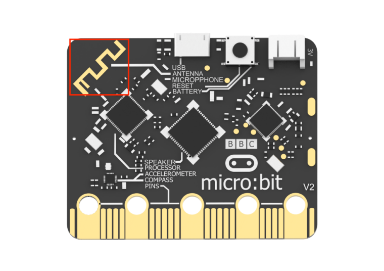
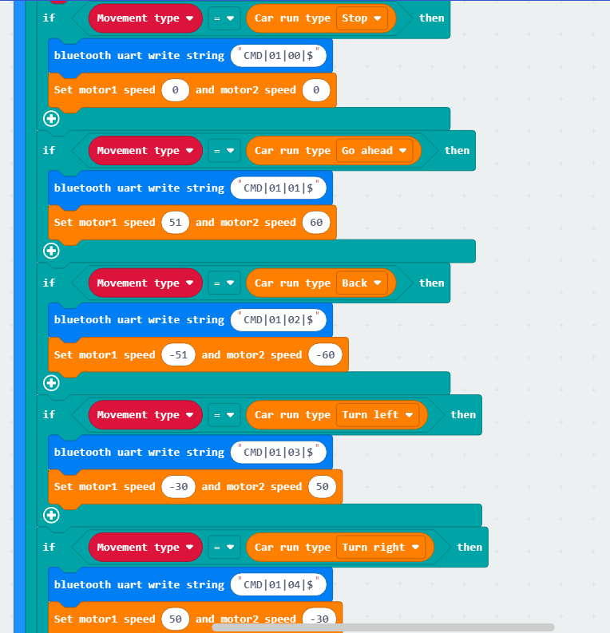
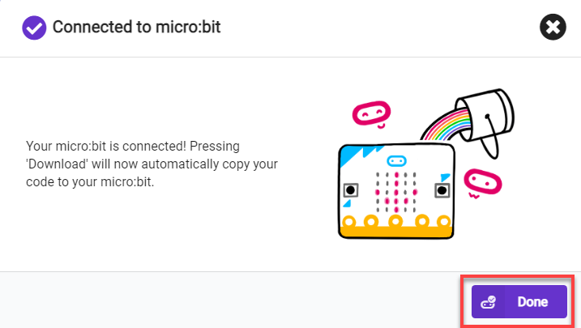
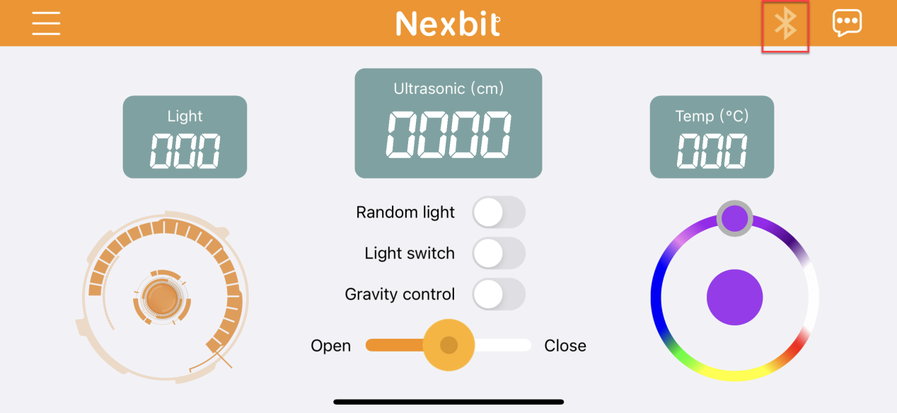
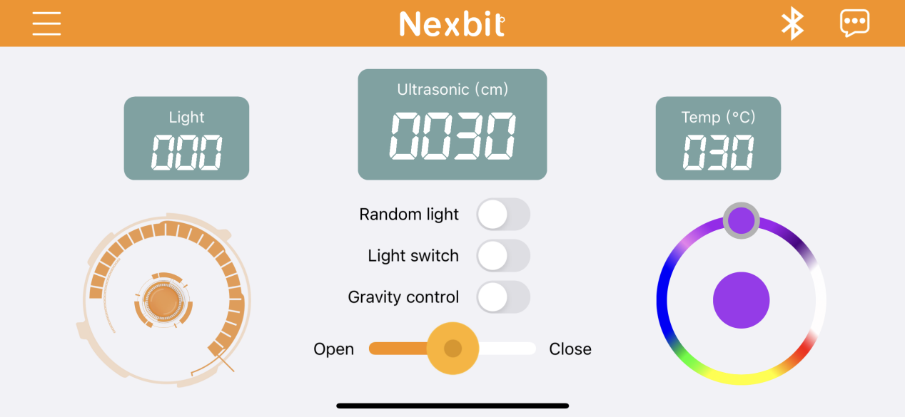
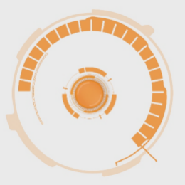
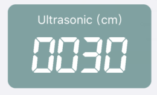
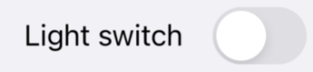

# 8. Mechanical Claw Control Course

## 8.1 Machanical Claw Assembly Tutorial

### 8.1.1 Starter Kit Assembly

[补充视频]

### 8.1.2 Hinge Bracket Assembly

[补充视频]

### 8.1.3 Gripper Assembly

[补充视频] 

## 8.2 Mechanical Claw Control

:::{Note}

The demonstration video in this section uses a top-down perspective as an example, and the content is equally applicable to other perspectives.

:::

### 8.2.1 Getting Ready

This project controls the opening and closing of the robotic gripper by touching the Logo on the micro:bit.

Before starting, ensure that the batteries are fully charged and correctly installed in the car's battery slot. Do not reverse the positive and negative terminals.

The claw servo is connected to the left interface at position 1 on the car.

:::{Note}

with the white pin as the rightmost pin, the pins **from right to left** are the signal line, power line, and GND. Corresponding servo wire colors: yellow, red, brown.

:::

### 8.2.2 Program Flowchart

### 8.2.3 Module Introduction

There is a touch sensor located at the Logo on the micro:bit.

### 8.2.4 Program Analysis

(1\) When the car is powered on, it will first go through the initialization process to ensure that the subsequent program can run smoothly.

(2\) When the logo is short-pressed, the servo angle is set to 20°, and the mechanical claw opens. When the logo is long-pressed, the servo angle is set to 90°, and the mechanical claw closes.

:::{Note}

When the servo angle is 95°, the claw is in a closed state; when the servo angle is 0°, the claw is in an open state. It is recommended not to set the angle greater than 95° or less than 0° to avoid causing servo stall.

:::

### 8.2.5 Program Download

[Mechanical Claw Control.hex]()

(1\) Connect the micro:bit board to the computer using a USB data cable. In the editing interface, click **"Connect Device"** and follow the prompts to establish the connection.

(2\) After a successful connection, click on the **"Download"** option at the bottom left of the page, and the program will be downloaded to the micro:bit board.

### 8.2.6 Gaming Experience

Short press on the logo, the mechanical claw opens; long press on the logo, the mechanical claw closes.

## 8.3 Intelligent Obstacle Clearing

:::{Note}

* Due to the reliance on the visual module in this game, ensure recognition under good lighting conditions to avoid potential impact on recognition results.

* It is recommended to use the forward-facing posture.

* Before starting, assemble the car into the hinge model and bend it downwards to 90 degrees.

:::

### 8.3.1 Getting Ready

In the program, through the recognition of color blocks, control the car to clear obstacles during the line-following process.

Before starting, ensure that the batteries are fully charged and correctly installed in the car's battery slot. Do not reverse the positive and negative terminals.

Connect the WonderCam Vision Module to any I2C interface on the car.

### 8.3.2 Program Flowchart

### 8.3.3 Module Introduction

The user-friendly WonderCam vision module can complete AI training with just one click. It can directly output recognition results to the controller, making it easy to implement various AI visual creative projects.

Connect the WonderCam Vision Module to any I2C interface on the robot.

Adjust the threshold of the line followers. Ensure that each sensor is in the off state when it detects the black line on the map, and in the on state when it detects the white area on the map. The robot needs to be assembled into a hinge model, with the vision module bent downwards by 90 degrees. Install the robotic gripper simultaneously. After installation, it should appear as shown in the following picture:

### 8.3.4 Program Analysis

* **Device Initialization**

After starting the car, it will go through an initialization process. This includes setting the address of the WonderCam Vision Module, switching to the **"Color Recognition"** function, setting the initial position of the servo, and initializing relevant variables.

The variable **"EnableLineFollow" i**s a switch for line-following movement. When it is set to 1, the car follows the line, and when set to 0, it stops line-following.

The variable **"Grip"** is a switch for gripping color blocks. When it is set to 0, gripping is performed, and when set to 1, gripping is not performed.

The variable **"Place"** is a switch for placing color blocks. When it is set to 0, placing is performed, and when set to 1, placing is not performed.

* **Sub-function Analysis**

(1) Define the **'Update Line Following'** function

By calling this function, the sensor detection status can be updated in real-time. In this context, the values of the line-following sensor probes are set to indicate the detection of a black line.

(2) Define the **'General Line Following'** function

Calling this function enables the car to perform line-following movements.

As follows:

① If line-following sensors 2 and 3 detect the black line, the car is directed to move forward. (Note: The speed of motor 1 and motor 2 during forward movement should be set based on the differential drive system of your specific car.)

② If the line-following sensors 1 and 2 detect the black line while sensors 3 and 4 do not detect the black line, it indicates that the car is veering to the right. In this case, the car needs to turn left.

③ Similarly, if line-following sensors 3 and 4 detect the black line while sensors 1 and 2 do not detect the black line, it indicates that the car is veering to the left. In this case, the car needs to turn right.

④ If line-following sensor 2 detects the black line and sensors 1, 3, and 4 do not detect the black line, indicating a slight deviation to the right, the program instructs the car to make a slight left turn. (Note: When the turning radius is small, the speed of motor 1 and motor 2 should be set based on the differential drive system of your specific car.)

⑤ Similarly, if line-following sensor 3 detects the black line and sensors 1, 2, and 4 do not detect the black line, indicating a slight deviation to the left, the program instructs the car to make a slight right turn. (Note: When the turning radius is small, the speed of motor 1 and motor 2 should be set based on the differential drive system of your specific car.)

(3) Define the **'Grip Block'** function

Calling this function enables the car to grip a block.

① When gripping, first make the car move forward a short distance to bring the color block into the grip range of the claw.

② Then, pause the line-following process, close the mechanical claw, and begin gripping the color block.

③ After gripping is completed, set **"Grip"** to 1 and **"Place"** to 0 to initiate the placement of the color block.

(4) Define the **'Place Block'** function

Calling this function enables the placement of the color block.

As follows:

① When one of the four probes of the line-following sensor detects a black line, turn the car to the left. As the car has not yet reached the placement position, at this point, set it to turn left for 100ms and release the mechanical claw.

② When none of the four probes of the line-following sensor are on the black line, make the car reverse. Continue reversing until the condition is no longer met, then exit.

③ Set the **"Place"** variable to 1 to prevent the car from performing further placement operations. Set the **"EnableLineFollow"** variable to 1 to allow the car to continue line-following and clearing obstacles.

* **Main Function Analysis**

Utilizing an infinite loop to keep the program continuously executing, this function defines the operational flow of intelligent obstacle clearing. A detailed analysis is as follows:

(1\) Update the detection status of the line-following sensor and obtain the results of color recognition. When the **"EnableLineFollow"** variable is set to 1, call the general line-following function to perform line-following movements.

(2\) During the line-following process, if a color block with ID 1 is recognized, stop line-following and set the **"EnableLineFollow"** variable and the **"Grip"** variable to 0.

(3\) When the **"EnableLineFollow"** variable is 0 and the **"Grip"** variable is 0, call the function **"Grip Block"** to grip the color block.

(4\) As shown in the diagram below, when the color block gripping is completed, the variable **"Grip"** is set to 1, and **"Place"** is set to 0. At this point, the function **"Place Block"** is called to place the color block.

### 8.3.5 Program Download

[Intelligent Obstacle Clearing.hex]()

(1\) Connect the micro:bit board to the computer using a USB data cable. In the editing interface, click **"Connect Device"** and follow the prompts to establish the connection.

:::{Note}

When downloading the program, make sure to disconnect the power to the car. Otherwise, after downloading the program, the car may run the program directly, leading to potential falls.

:::

(2\) After a successful connection, click on the **"Download"** option at the bottom left of the page, and the program will be downloaded to the micro:bit board.

### 8.3.6 Gaming Experience

Place the car on the map. After powering on, the WonderCam Vision Module will switch to the **"Color Recognition"** function and start line-following. When the car recognizes a color block with ID 1 during the line-following process, it will stop line-following and perform gripping and placing operations on the color block. Afterward, it will reverse, continue line-following, and proceed with the recognition, gripping, and placing.

## 8.4 APP Remote Handling

:::{Note}

The demonstration video in this section uses a top-down perspective as an example, and the content is equally applicable to other perspectives.

:::

### 8.4.1 Getting Ready

The micro:bit board comes with a built-in Bluetooth antenna. By programming, the app can connect and communicate with the car to control its movement.

Before starting, ensure that the batteries are fully charged and correctly installed in the car's battery slot. Do not reverse the positive and negative terminals.

The claw servo is connected to the left interface at position 1 on the car.

:::{Note}

with the white pin as the rightmost pin, the pins **from right to left** are the signal line, power line, and GND. Corresponding servo wire colors: yellow, red, brown.

:::

### 8.4.2 Program Flowchart

### 8.4.3 Module Introduction

The micro:bit board comes with a built-in Bluetooth antenna. The position of the Bluetooth module is shown below:

### 8.4.4 Program Analysis

(1\) First, when the car is powered on, it will undergo initialization operations, including displaying patterns on the matrix module after initialization is complete, and indicating connection success or failure on the matrix module.

(2\) Establish a Bluetooth connection and read firmware information. Then, identify the command type and perform corresponding operations for different command types.

### 8.4.5 Program Download

[APP Remote Handling.hex]()

:::{Note}

When downloading the program, make sure to disconnect the power to the car. Otherwise, after downloading the program, the car may run the program directly, leading to potential falls.

:::

(1) Connect the micro:bit board to the computer using a USB data cable. In the editing interface, click **"Connect Device"** and follow the prompts to establish the connection.

(2\) After a successful connection, click on the **"Download"** option at the bottom left of the page, and the program will be downloaded to the micro:bit board.

### 8.4.6 Gaming Experience

* **APP Connection**

:::{Note}

* Before using the app, please enable Bluetooth and location services in the phone settings.

* Use the Bluetooth button within the Wonderbit app to pair and connect with the device. Do not pair through the phone settings using a passkey.

:::

The specific steps are as follows:

(1\) Enable Bluetooth and location services on the phone.

(2\) Open the Wonderbit APP, click on the three horizontal bars in the popped-up main interface, and switch the device to **"Nexbit."**

(3\) Click on the Bluetooth connection icon in the upper right corner of the app, and in the popped-up device search interface, click on the upper right device list. Select the Bluetooth with the name **"BBC micro:bit"** to establish a connection.

* **App Operation**

The main interface is shown below:

The corresponding button descriptions are shown in the following table:

| **Icon**                                                     | **Function**                                                 |
| ------------------------------------------------------------ | ------------------------------------------------------------ |
|  | Control Nexbit to move forward, backward, and turn.          |
|  | Display the light intensity at Nexbit's current location.    |
|  | Display the distance from the ultrasonic sensor on Nexbit to an object in front of it. |
|  | Display the temperature at Nexbit's current location.        |
|  | Activate this button, and the two colored lights on Nexbit will display random colors within a certain range.。 |
|  | Activate this button, and the colored lights will turn on. Turn off the switch, and the lights will turn off. |
|  | Activate this button, and Nexbit can be moved through gravity sensing. |
|  | Control the color of Nexbit's lights through the slider knob. |
|  | Control servo 1 to open or close the mechanical claw.        |

## 8.5 Handlebit Remote Handling

:::{Note}

The demonstration video in this section uses a top-down perspective as an example, and the content is equally applicable to other perspectives. Please prepare two micro:bit boards in advance, and purchase the Handlebit handle.

:::

### 8.5.1 Getting Ready

This project controls the car’s movement via the Handlebit handle.

Before starting, ensure that the batteries are fully charged and correctly installed in the car's battery slot. Do not reverse the positive and negative terminals.

The claw servo is connected to the left interface at position 1 on the car.

:::{Note}

with the white pin as the rightmost pin, the pins **from right to left** are the signal line, power line, and GND. Corresponding servo wire colors: yellow, red, brown.

:::

### 8.5.2 Program Flowchart

### 8.5.3 Module Introduction

The micro:bit board comes with a built-in wireless transmission and reception module. You only need to invoke its module to achieve wireless data transmission.

The position of Bluetooth transmission on the micro:bit, as shown in the diagram:

Each button on the Handlebit handle corresponds to a number, and when pressed, this number can be wirelessly transmitted. When the robot receives this number, you can write corresponding execution statements. This way, through this "two-way" communication, wireless transmission and control are achieved.

### 8.5.4 Program Analysis

The following diagram is the main program of sender:

The following diagram is the main program of receiver:

:::{Note}

Due to different usage scenarios, values for motor and time settings need to be adjusted based on the actual conditions.

:::

Firstly, the transmitter, which is the program for our Handlebit handle, performs initialization during startup. At the same time, it sets the wireless transmission group, with the default being group 1. The subsequent receiver must also be set to group 1 to receive wireless messages sent by the transmitter.

Next is the definition of the buttons that the handle will use. For example, when we move the joystick, the micro:bit board will calculate the X and Y values of the joystick. When moved to a certain extent, it will then emit the corresponding signal.

Then, moving on to the receiver, similarly, the receiver will first perform initialization operations on the robot. It will set the wireless group to 1 so that both sides can establish a connection. After that, it will set initial variables for the subsequent control of the claw servo motor.

Upon receiving messages from the transmitter, the receiver will execute the corresponding actions. For instance, if it receives message number 3, indicating that the joystick is pushed backward, the corresponding action would be the car moving backward. You can experience other specific actions after downloading the program.

### 8.5.5 Program Download

[Nexbit-Receiver.hex]()

[Handlebit-Sender.hex]

(1\) Connect the micro:bit board to the computer using a USB data cable. In the editing interface, click **"Connect Device"** and follow the prompts to establish the connection.

:::{Note}

When downloading the program, make sure to disconnect the power to the car. Otherwise, after downloading the program, the car may run the program directly, leading to potential falls.

:::

(2\) After a successful connection, click on the **"Download"** option at the bottom left of the page, and the program will be downloaded to the micro:bit board.

### 8.5.6 Gaming Experience

When two micro:bit boards have downloaded the corresponding programs and are installed into the remote control and the robot, the remote control sends out commands, and the robot, upon receiving the wireless data, will execute the corresponding actions.

