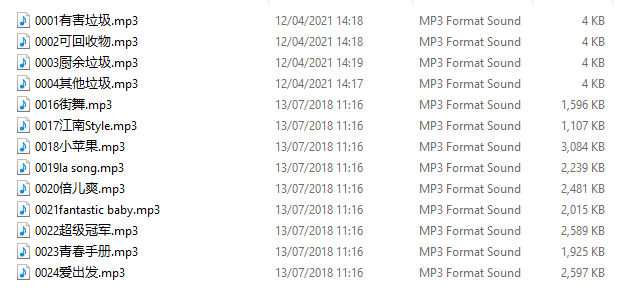
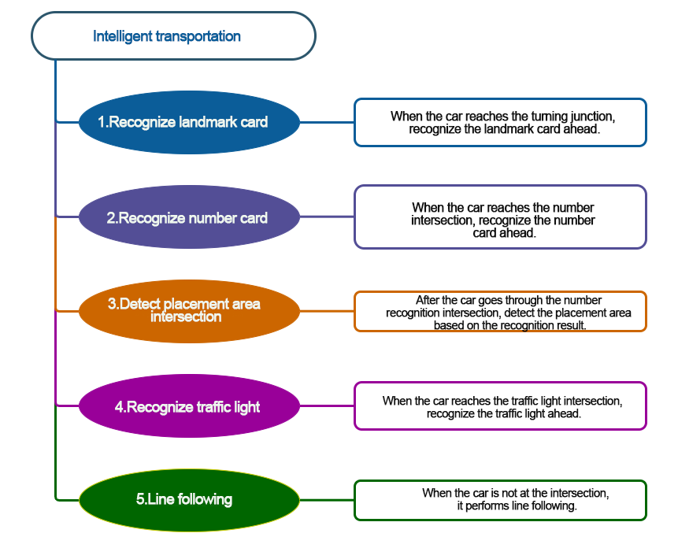

# 9. Sensor Expansion Course

## 9.1 MP3 Playback

### 9.1.1 Assembly

[补充视频]

### 9.1.2 Getting Ready

[Music Files](https://drive.google.com/drive/folders/1qchPkusg25fv_5A-AyhDgTNWXxGDvSuc?usp=sharing)

In the program, make the MP3 player play the music stored on the TF card via the buttons.

Before starting, ensure that the batteries are fully charged and correctly installed in the car's battery slot. Do not reverse the positive and negative terminals.

### 9.1.3 Program Flowchart

### 9.1.4 Module Introduction

The MP3 module can play music with simple commands. The module uses a 4-pin interface. It supports MP3, WAV, WMA hard decoding, TF memory card driver, and FAT16 and FAT32 file systems.

Connect the MP3 music Module to any IIC interface on the car.

### 9.1.5 Program Analysis

(1) First, initialize Nexbit and the MP3 module when powered on, setting it to play music at a volume of 20.

(2) When the **"A"** key is pressed, switch to the previous song; when the **"B"** key is pressed, switch to the next song; when both **"A"** and **"B"** keys are pressed simultaneously, pause the music.

### 9.1.6 Program Download

[MP3 Playback.hex](../_static/source_code/Programs.zip)

(1) Connect the micro:bit board to the computer using a USB data cable. In the editing interface, click **"Connect Device"** and follow the prompts to establish the connection.

:::{Note}

When downloading the program, make sure to disconnect the power to the car. Otherwise, after downloading the program, the car may run the program directly, leading to potential falls.

:::

(2) After a successful connection, click on the **"Download"** option at the bottom left of the page, and the program will be downloaded to the micro:bit board.

### 9.1.7 Gaming Experience

(1) Insert the TF card into any USB port on your computer using a card reader.

(2) Create a new folder named **"MP3"** inside the TF card.

(3) Place the songs you want to play inside this folder. The naming format for the songs should be as follows: 0001 + Song Name. For example, if the song is **"Little Apple,"** you can name it as follows: 0001 Little Apple. You can also use only the number, such as 0001, and continue in the same pattern for other songs, like 0010, 0100, 1000, and so on. (This course comes with installed music files; please go to the **"Music Files"** folder in the same directory to access them.)

:::{Note}

In the game, tracks 0001 to 0004 are voice prompts for waste sorting. Please do not move or delete them, as doing so may result in the inability to use the feature properly.

:::

(4) Insert the TF card into the MP3 module with the orientation as shown in the diagram below:

After the car is powered on, it automatically plays the first song stored on the TF card. When button 'B' is pressed, it switches to the next song, and when button 'A' is pressed, it switches to the previous song.

## 9.2 Waste Sorting Voice Prompt

### 9.2.1 Assembly

[补充视频]

### 9.2.2 Getting Ready

In the program, use the vision module to recognize the waste categories, and then control the MP3 module to play the corresponding voice prompt for the classified waste.

Before starting, ensure that the batteries are fully charged and correctly installed in the car's battery slot. Do not reverse the positive and negative terminals.

:::{Note}

Due to the use of the visual module in this game, make sure to recognize a background with white (or other light-colored) surfaces. Ensure good lighting conditions for recognition; otherwise, it may affect recognition results.

:::

### 9.2.3 Program Flowchart

### 9.2.4 Module Introduction

(1) The MP3 module can play music with simple commands.

The module uses a 4-pin interface. It supports MP3, WAV, WMA hard decoding, TF memory card driver, and FAT16 and FAT32 file systems.

(2) The user-friendly WonderCam vision module can complete AI training with just one click. It can directly output recognition results to the controller, making it easy to implement various AI visual creative projects.

Connect the WonderCam Vision Module to any I2C interface on the robot.

### 9.2.5 Program Analysis 

(1) First, initialize Nexbit when powered on, initialize the vision module, switch to image classification mode, and set the volume of the MP3 module to **20**.

(2) When the vision module does not detect a waste card, pause the playback of the MP3 module, and the dot matrix does not display any pattern.

(3) When the vision module detects waste with IDs "**2 to 4"**, the MP3 module plays the voice prompt **"Hazardous Waste"**, and the dot matrix module displays the corresponding pattern.

(4) When the vision module detects waste with IDs **"5 to 7"**, the MP3 module plays the voice prompt **"Recyclable Material"**, and the dot matrix module displays the corresponding pattern.

(5) When the vision module detects waste with IDs **"8 to 10"**, the MP3 module plays the voice prompt **"Kitchen Waste"**, and the dot matrix module displays the corresponding pattern.

(6) When the vision module detects waste with IDs **"11 to 13"**, the MP3 module plays the voice prompt **"Other Waste"**, and the dot matrix module displays the corresponding pattern.

### 9.2.6 Program Download

[Waste Sorting Voice Prompt.hex](../_static/source_code/Programs.zip)

(1) Connect the micro:bit board to the computer using a USB data cable. In the editing interface, click **"Connect Device"** and follow the prompts to establish the connection.

:::{Note}

Due to different usage scenarios, values for motor and the sensitivities of the sensor need to be adjusted based on actual conditions, or it may lead to the malfunction of the robot.

:::

(2) After a successful connection, click on the **"Download"** option at the bottom left of the page, and the program will be downloaded to the micro:bit board.

### 9.2.7 Gaming Experience

(1) Insert the TF card into any USB port on your computer using a card reader.

(2) Ensure that the TF card contains the four voice files shown in the figure below. If not, you can click [Music Files](https://drive.google.com/drive/folders/1qchPkusg25fv_5A-AyhDgTNWXxGDvSuc?usp=sharing)  to obtain them. Copy the voice files to the TF card, ensuring that the numbering matches the figure below.

(3) Insert the TF card into the MP3 module with the orientation as shown in the diagram below:

After the car is powered on, place the waste card in front of the vision module. The vision module recognizes the category of the waste, and then the MP3 module is used to voice the corresponding category of it. The waste cards and their corresponding IDs are as follows:

<table border="1" class="docutils" style="max-width:720px;width:100%;text-align: center;">
<thead>
<tr>
<th><strong>Image</strong></th>
<th><strong>ID</strong></th>
<th><strong>Image</strong></th>
<th><strong>ID</strong></th>
</tr>
</thead>
<tbody>
<tr>
<td>Background</td>
<td>1</td>
<td></td>
<td>2</td>
</tr>
<tr>
<td></td>
<td>3</td>
<td></td>
<td>4</td>
</tr>
<tr>
<td></td>
<td>5</td>
<td></td>
<td>6</td>
</tr>
<tr>
<td></td>
<td>7</td>
<td></td>
<td>8</td>
</tr>
<tr>
<td></td>
<td>9</td>
<td></td>
<td>10</td>
</tr>
<tr>
<td></td>
<td>11</td>
<td></td>
<td>12</td>
</tr>
<tr>
<td></td>
<td>13</td>
<td></td>
<td></td>
</tr>
</tbody>
</table>

<table border="1" class="docutils" style="max-width:720px;width:100%;text-align: center;">
<thead>
<tr>
<th><strong>Waste Card ID</strong></th>
<th><strong>The voice prompt numbering on the TF card</strong></th>
<th><strong>Pattern</strong></th>
</tr>
</thead>
<tbody>
<tr>
<td>Hazardous Waste（2-4）</td>
<td>0001</td>
<td></td>
</tr>
<tr>
<td>Recyclable Waste（5-7）</td>
<td>0002</td>
<td></td>
</tr>
<tr>
<td>Kitchen Waste（8-10）</td>
<td>0003</td>
<td></td>
</tr>
<tr>
<td>Other Waste（11-13）</td>
<td>0004</td>
<td></td>
</tr>
</tbody>
</table>

## 9.3 Smart Fan

### 9.3.1 Assembly

[补充视频]

### 9.3.2 Getting Ready

In the program, utilize the vision module for facial recognition, and then control the fan module to rotate.

Connect the WonderCam Vision Module and the Fan Module to any I2C interface position on the car.

Ensure that the batteries are fully charged and correctly installed in the car's battery slot. (Note: Do not reverse the positive and negative terminals.)

:::{Note}

Due to the use of the visual module in this game, make sure to recognize a background with white (or other light-colored) surfaces. Ensure good lighting conditions for recognition; otherwise, it may affect recognition results.

:::

### 9.3.3 Program Flowchart

### 9.3.4 Module Introduction

(1) The fan module does not require an additional motor driver board. Its speed can be adjusted.

The fan sensor controls the direction of the fan's rotation through two-directional PWM pulse waveforms. The duty ratio of the PWM pulse width can be adjusted to set the fan speed.

(2) The user-friendly WonderCam vision module can complete AI training with just one click. It can directly output recognition results to the controller, making it easy to implement various AI visual creative projects.

Connect the WonderCam Vision Module and the fan module to any I2C interface on the robot.

### 9.3.5 Program Analysis 

(1) First, initialize Nexbit when powered on, initialize the vision module, and switch to the face recognition function.

(2) When a face is detected, display a smiling face on the dot matrix and set the fan speed to 80. When no face is detected, do not display any pattern on the dot matrix, and set the fan speed to 0.

### 9.3.6 Program Download

[Smart Fan.hex](../_static/source_code/Programs.zip)

(1) Connect the micro:bit board to the computer using a USB data cable. In the editing interface, click **"Connect Device"** and follow the prompts to establish the connection.

:::{Note}

Due to different usage scenarios, values for motor and the sensitivities of the sensor need to be adjusted based on actual conditions, or it may lead to the malfunction of the robot.

:::

(2) After a successful connection, click on the **"Download"** option at the bottom left of the page, and the program will be downloaded to the micro:bit board.

### 9.3.7 Gaming Experience

After the car is powered on, align the vision module with a face. When a face is recognized, a smiling face will be displayed on the micro:bit dot matrix, and the fan will start rotating.

## 9.4 Reverse Parking

### 9.4.1 Assembly

[补充视频]

### 9.4.2 Getting Ready

In the program, combine the WonderCam vision module with the infrared obstacle avoidance sensor to achieve the reverse parking.

Connect the WonderCam vision module and the ultrasonic sensor module to any I2C interface on the car chassis. Connect the infrared obstacle avoidance sensor to the GPIO interface on the car chassis.

Ensure that the batteries are fully charged and correctly installed in the car's battery slot. (Note: Do not reverse the positive and negative terminals.)

Note:Due to the use of the visual module in this game, make sure to recognize a background with white (or other light-colored) surfaces. Ensure good lighting conditions for recognition; otherwise, it may affect recognition results.

### 9.4.3 Program Flowchart

### 9.4.4 Module Introduction

(1) The infrared obstacle avoidance sensor is used to detect obstacles in front of it.

The sensor has an infrared emitter and an infrared receiver. Once the sensor encounters an obstacle, the infrared light will be reflected back and received by the receiver.

Connect the infrared obstacle avoidance sensor to the GPIO interface on the car chassis.

(2) The user-friendly WonderCam vision module can complete AI training with just one click. It can directly output recognition results to the controller, making it easy to implement various AI visual creative projects.

Connect the WonderCam Vision Module to any I2C interface on the robot.

### 9.4.5 Program Analysis

(1) First, initialize Nexbit when powered on, initialize the vision module, and switch it to tag recognition mode. Then, set the brightness of the RGB light when illuminated to 255, the maximum brightness.

(2) After the initialization, the WonderCam Vision Module continuously updates and retrieves tag recognition results. When it recognizes tag 1, initiate the reverse parking into the garage.

When the infrared obstacle avoidance sensor does not detect obstacles, continue moving backward by setting the motor speed (**motor and time values need to be adjusted according to the actual situation**). When an obstacle is detected, the car will stop immediately, emit a **'beep'** sound, and turn on a red light.

(3) Then, instruct the car to make a right turn. When the infrared obstacle avoidance sensor detects an obstacle and stops, emit two 'beep beep' sounds. Finally, turn off the illuminated RGB light, completing the reverse parking into the garage. Otherwise, the car will continue moving backward.

### 9.4.6 Program Download

[Reverse Parking.hex](../_static/source_code/Programs.zip)

(1) Connect the micro:bit board to the computer using a USB data cable. In the editing interface, click **"Connect Device"** and follow the prompts to establish the connection.

:::{Note}

When downloading the program, make sure to disconnect the power to the car. Otherwise, after downloading the program, the car may run the program directly, leading to potential falls.

:::

(2) After a successful connection, click on the **"Download"** option at the bottom left of the page, and the program will be downloaded to the micro:bit board.

### 9.4.7 Gaming Experience

After the car is powered on, the WonderCam Vision Module switches to tag recognition mode. When it recognizes a tag with ID 1, it initiates reverse parking. The infrared obstacle avoidance sensor continuously checks if there are obstacles behind the car. If no obstacles are detected, the car continues to reverse. If an obstacle is detected, the car stops immediately, emits a **'beep'** sound, and turns on a red light. Then, the car continues reversing after making a right turn. It stops again when the infrared obstacle avoidance sensor detects an obstacle, emits two **'beep beep'** sounds, and finally turns off the RGB light, completing the reverse parking into the garage.

## 9.5 Ball Throwing Machine

### 9.5.1 Assembly

[补充视频]

### 9.5.2 Getting Ready

The micro:bit board comes with a built-in sound sensor. By evaluating the volume of sound, the angle of the servo motor is adjusted, ultimately achieving ball throwing.

Before starting, ensure that the batteries are fully charged and correctly installed in the car's battery slot. Do not reverse the positive and negative terminals.

Connect the servo motor to the 1st position of the left PWM servo interface on the car.

Note the wiring direction: with the white pin as the rightmost pin, the pins from right to left are the signal line, power line, and GND. Corresponding servo wire colors: yellow, red, brown.

### 9.5.3 Program Flowchart

### 9.5.4 Module Introduction

There is a sound sensor on the micro:bit board, as shown below:

The sound sensor can detect the sound level in the environment and convert it into a numerical range of 0 to 255. The maximum volume is 255.

### 9.5.5 Program Analysis

(1) First, initialize Nexbit when powered on, and set the initial angle of the servo motor to 105°, configuring an initial posture for the ball throwing machine.

(2) After the initialization, the sound sensor on the micro:bit board continuously detects the volume of external sounds. When the sound volume exceeds our set threshold (110), set the servo motor angle to quickly move to 60°, throwing the ball forward. Then, set the servo motor angle to 105°, returning the ball throwing machine to the initial posture after throwing the ball, and continue with sound detection.

### 9.5.6 Program Download

[Ball Throwing Machine.hex](../_static/source_code/Programs.zip)

(1) Connect the micro:bit board to the computer using a USB data cable. In the editing interface, click **"Connect Device"** and follow the prompts to establish the connection.

:::{Note}

When downloading the program, make sure to disconnect the power to the car. Otherwise, after downloading the program, the car may run the program directly, leading to potential falls.

:::

(2) After a successful connection, click on the **"Download"** option at the bottom left of the page, and the program will be downloaded to the micro:bit board.

### 9.5.7 Gaming Experience

After the car is powered on, the ball throwing machine will assume an initial position. When the car detects a sound volume greater than 110, the ball throwing mechanism will initiate the ball throwing operation and then return to the initial position.

:::{Note}

It is recommended to perform this game in a quiet environment to avoid interference from surrounding noise.

:::

## 9.6 Intelligent reception

### 9.6.1 Assembly

[补充视频]

### 9.6.2 Getting Ready

The program first utilizes the face recognition feature to search for faces within the camera's field of view. Once a face is recognized, it will change the rotation angles of the left and right servo motors to achieve a waving gesture.

(1) Assemble the LEGO servo motor onto the robot according to the assembly instructions. From the robot's perspective, the servo motor on the right side is servo motor 1, and the one on the left side is servo motor 2.

(2) Ensure that the batteries are fully charged and correctly installed in the car's battery slot. (Note: Do not reverse the positive and negative terminals.)

:::{Note}

Due to the use of the vision module in this game, ensure that the background is white (or another light color) to guarantee optimal recognition under good lighting conditions. Otherwise, it may affect the recognition results.

:::

### 9.6.3 Program Flowchart

### 9.6.4 Module Introduction

The user-friendly WonderCam vision module can complete AI training with just one click. It can directly output recognition results to the controller, making it easy to implement various AI visual creative projects.

Connect the WonderCam Vision Module to any I2C interface on the robot.

### 9.6.5 Program Analysis

The following diagram shows the main program:

(1) When the program is initiated, the robot will first perform initialization operations, simultaneously configuring the address of the WonderCam Vision Module and switching to the **"Face Recognition"** function.

(2) At this point, servo motor 1 and servo motor 2 will return to their initial positions. Specifically, control servo motor 1 to return to position 80, and servo motor 2 to return to position 100.

(3) Subsequently, it continuously updates the recognition, determining whether a face has been detected. If a face is recognized, the dot matrix module will display a smiling expression. Then, control servo motor 1 to rotate to a position of 60° within 300 milliseconds and servo motor 2 to rotate to a position of 120° within 300 milliseconds. After that, servo motor 1 moves to a position of 120°, and servo motor 2 moves to a position of 60°, repeating this cycle 4 times.

### 9.6.6 Program Download

[Intelligent reception.hex](../_static/source_code/Programs.zip)

(1) Connect the micro:bit board to the computer using a USB data cable. In the editing interface, click **"Connect Device"** and follow the prompts to establish the connection.

(2) After a successful connection, click on the **"Download"** option at the bottom left of the page, and the program will be downloaded to the micro:bit board.

### 9.6.7 Gaming Experience

After downloading the program and starting the car, the WonderCam Vision Module will switch to the **"Facial Recognition"** function, and the two LEGO servo motors on the car will reset. Subsequently, it will continuously update the recognition to check if a face is detected.

If a face is recognized, the LED matrix module on the board will display a smiling expression, the servo motors will keep rotating, and the corresponding building blocks will wave, creating a waving effect. If no face is recognized, the dot matrix module will not light up, and the servo motors will reset to their initial positions.

## 9.7 Maze Obstacle Avoidance

### 9.7.1 Assembly

[补充视频]

### 9.7.2 Getting Ready

Combine the ultrasonic sensor and infrared obstacle avoidance sensor with the car. Change the angle of the servo motor and use the ultrasonic sensor to detect the distance to obstacles. By comparing the distance values in different directions, determine the direction of the obstacle, ultimately achieving obstacle avoidance.

Ensure that the batteries are fully charged and correctly installed in the car's battery slot. 

:::{Note}

Do not reverse the positive and negative terminals.

:::

### 9.7.3 Program Flowchart

### 9.7.4 Module Introduction

The module automatically sends 8 square waves of 40kHz when measuring distance, and then checks for signal returns. If a signal is returned, it outputs a high level, and the duration of the high level is the time taken for the ultrasonic wave to travel from transmission to return.

The specific formula is: Distance = (High-Level Time \* Speed of Sound (340m/s)) / 2.

Connect the ultrasonic sensor to any I2C interface on the robot.

### 9.7.5 Program Analysis

* **Device Initialization**

After starting the car, it will undergo an initialization process. This includes initializing relevant variables, setting the brightness of the RGB light to the maximum, setting the initial position of the servo motor, and orienting the ultrasonic sensor towards the front.

The variable **"avoidance"** is a binary switch for maze obstacle avoidance. When it is set to 1, the car starts maze obstacle avoidance; when set to 0, the car remains stationary.

The variable **"rotation direction"** represents the direction of the car's rotation: 1 for forward, 2 for right turn, and 3 for left turn.

The variable **"distance"** indicates the distance from the ultrasonic sensor to the obstacle in front of the car.

* **Sub-function Analysis**

(1) Define the **"Servo Swing"** function

When the car detects an obstacle in front, this function is called for further assessment of whether there are obstacles on the left and right. The ultrasonic sensor will then swing from left to right, sequentially detecting the distance to the obstacle in front.

The specific analysis is as follows:

① Initially, set the servo motor angle to 140°, turning the ultrasonic sensor to the left, and assign the distance value detected by the ultrasonic sensor to the left obstacle to the variable **"L-distance."** Then, set the servo motor angle to 115°, turning it to the left front, and assign the measured value to the variable **"distance."**

② If the value on the left side **(L-distance)** is greater than the value on the left front side **(distance)**, then assign the value in the **"distance"** variable to **"L-distance."** This means saving the closest distance to the obstacle in the **"L-distance"** variable, which will be utilized in the subsequent **"Obstacle Judgment"** function.

③ Similarly to the left-side detection, sequentially set the servo motor angles to 90°, 65°, and 40°. This turns the ultrasonic sensor to the directly forward, right front, and right side positions. Assign the distances from the ultrasonic sensor to obstacles on the right front and right side to the variables **"R-distance"** and **"distance,"** respectively. Then, compare the values of these two variables and, similarly, keep the closest distance value in the **"R-distance"** variable.

④ Finally, turn the ultrasonic sensor back to the directly forward position and call the **"Obstacle Judgment"** function to determine the direction of the obstacle.

(2) Define the **"Obstacle Judgment"** function

After calling this function, compare the distances between the ultrasonic sensor and obstacles in different directions to determine the rotation direction of the car.

The specific analysis is as follows:

① When the distances from the left and right to the obstacle in front are both less than 150mm (15cm), it indicates that there are obstacles on both the left and right sides of the car. In this case, the two RGB lights on the car chassis will turn red and display for 500ms. Then, the **"Back"** function is called to make the car move backward.

②  If the distance to the obstacle on the left is less than 15cm, set the variable **"rotation direction"** to 2, indicating a right turn. If the distance to the obstacle on the right is less than 15cm, set the variable **"rotation direction"** to 3, indicating a left turn.

③ If none of the above three conditions are met, set the variable **"rotation direction"** to 3 for a left turn.

(3) Define the **"Back"** function

This function is called when obstacles are detected on both the left and right sides of the car.

First, make the car move backward for 15 seconds and then stop. Then, call the **"Servo Swing"** and **"Obstacle Judgment"** functions to allow the car to continue obstacle avoidance.

* **Main Function Analysis**

Use an infinite loop to continuously execute the program, defining the maze running process within this function. The specific analysis is as follows:

(1) When button A is pressed, the variable **"avoidance"** becomes 1, and the car starts maze obstacle avoidance. When the ultrasonic sensor detects a distance to the obstacle in front less than 15cm, stop moving forward and call the **"Servo Swing"** function to detect distances to obstacles in different directions. Otherwise, continue moving forward.

(2) When the rotation direction is 2, indicating an obstacle on the left, the left light on the car chassis will turn red, and the rotation direction is set back to the initial value of 1. Then, turn off the RGB lights and make the car turn left by setting the motor speed. When the rotation direction is 3, indicating an obstacle on the right, the right light on the car chassis will turn red, and the car will turn left to avoid the obstacle.

### 9.7.6 Program Download

[Maze Obstacle Avoidance.hex](../_static/source_code/Programs.zip)

(1) Connect the micro:bit board to the computer using a USB data cable. In the editing interface, click **"Connect Device"** and follow the prompts to establish the connection.

(2) After a successful connection, click on the **"Download"** option at the bottom left of the page, and the program will be downloaded to the micro:bit board.

### 9.7.7 Gaming Experience

After downloading the program and starting the robot, the car is initially in a stationary state. When the **"A"** button is pressed, the car will move forward in a straight line.

While moving forward, if an obstacle is detected, the car will stop, and then the ultrasonic sensor will swing from left to right, sequentially detecting obstacles in different directions. If obstacles are present in all three directions, the car will reverse for a certain distance and then continue ultrasonic detection.

If an obstacle is detected on the right, the car will turn left and then move forward. If an obstacle is detected on the left, the car will turn right and then move forward. If an obstacle is detected in the front, but there are no obstacles on the left or right, the car will default to turning left, achieving obstacle avoidance.

## 9.8 Intelligent Transportation

### 9.8.1 Assembly

[补充视频]

### 9.8.2 Getting Ready

Integrate the WonderCam Vision Module with the car by switching the module to specific functions, such as achieving line following, landmark recognition, goods placement, traffic light recognition.

Before starting, ensure that the batteries are fully charged and correctly installed in the car's battery slot. Do not reverse the positive and negative terminals.

Place the car on the black line in the placement area, with the front of the car facing towards the starting point.

### 9.8.3 Program Flowchart

### 9.8.4 Module Introduction

The user-friendly WonderCam vision module can complete AI training with just one click. It can directly output recognition results to the controller, making it easy to implement various AI visual creative projects.

Connect the WonderCam Vision Module to any I2C interface on the robot.

Adjust the WonderCam Vision Module to the forward-facing position, as shown in the following picture:

### 9.8.5 Program Analysis

After downloading the program and starting the robot, the car is initially in a stationary state.

When you press the **A** button, the car will start line-following forward.

While moving forward, if it detects the starting point, the car will pause for a moment and then continue moving forward in a straight line. At the same time, the WonderCam Vision Module will switch its functionality to road landmark recognition.

When the car arrives at the first intersection in the landmark recognition area, it will stop and then recognize the landmark. If it recognizes a left-turn landmark, the car will turn left and then continue driving; the same applies for a right-turn landmark. After the car exits the second intersection, it will switch the functionality of the WonderCam Vision Module to number recognition.

When the car arrives at the intersection in the number recognition area, it will stop and then recognize the number. If it recognizes the number 1, it will transport the cargo to the unloading area for 1; if it recognizes the number 2, it will transport the cargo to the unloading area for 2. When the car exits the unloading area for number 2, it will switch the functionality of the WonderCam Vision Module to color recognition.

When the car arrives at the intersection in the traffic light recognition area, it will stop and then recognize the color of the traffic light. If it recognizes yellow or red, the car will continue to wait while both sides' RGB lights illuminate the corresponding color. If it recognizes green, the car will continue forward in line-following mode.

When the car returns to the starting point, it will switch the functionality of the WonderCam Vision Module to road sign recognition and then continue line-following.

* **Device Initialization**

After starting the car, it will undergo an initialization process. This includes initializing relevant variables, setting the WonderCam Vision Module to no functionality, setting the brightness of the RGB light to the maximum, and setting the initial position of the servo motor to 110, causing the car's carriage to lift slightly upwards.

(1) The variable **"start"** is a binary switch for intelligent transportation. When it is set to 1, the transportation begins, and when it is set to 0, the car remains stationary.

(2) The variable **"current stage"** represents the current stage of the transportation process. The intelligent transportation process is divided into 5 stages:

When it is 0, it is the starting point detection stage. If no starting point is detected, the car will pass through intersections directly without recognition.

When it is 1, it is the road sign recognition stage. The car will stop and recognize road signs when it encounters intersections.

When it is 2, it is the number recognition stage. The car will stop and recognize numbers when it encounters intersections.

When it is 3, it is the placement stage. The car will place the cargo in the area specified by the number recognition result when it encounters intersections.

When it is 4, it is the traffic light recognition stage. The car will stop and recognize red traffic lights when it encounters intersections.

(3) The variable **"placement location"** represents the number of the area where the goods are placed.

(4) The variable **"intersection count"** is used to determine if the current intersection corresponds to the **placement location**. The variable **"skip"** is a binary switch for skipping the intersection of the placement area for number 2. If the placement location is 1, this variable is usually set to 1. After placing the goods in area 1, it will skip the recognition of the intersection for the placement area of number 2.

(5) The variable **"next"** is used to set the recognition count. By recognizing the results multiple times, it helps avoid misrecognition.

* **Sub-function Analysis**

(1) Define the **"update line following"** function

Retrieve the results detected by the four line-following sensors and store them in the variables **"Sensor1, Sensor2, Sensor3, Sensor4"** for convenient intersection detection in subsequent steps.

(2) Define the **"generic line following"** function

This function is primarily used to enable the car to follow the line smoothly during the line-following process.

Specific analysis is as follows:

① When both of the middle two line-following sensors detect the black line, it indicates that the car is currently in the middle of the line. In this case, the car simply needs to move forward in a straight line.

② If the above condition is not met, check if the two sensors on the left side are outside the black line while the two sensors on the right side are inside the black line. This indicates that the car is deviating significantly to the left. To correct this, the 1st motor will rotate quickly while the 2nd motor stops, allowing the car to make a large adjustment to the right. Similarly, if the two sensors on the right side are outside the black line while the two sensors on the left side are inside the black line, the car will make a large adjustment to the left.

③ If line-following sensor 3 is inside the black line while the other sensors are outside the black line, it indicates a slight deviation to the left. To make a minor adjustment, the speed of motor 1 is reduced while the speed of motor 2 is increased, allowing the car to make a slight adjustment to the right. Similarly, if line-following sensor 2 is inside the black line while the others are outside, a similar minor adjustment is made.

(3) Define the **"starting point detection stage"** function

When the car is detecting the starting point (all four line-following sensors simultaneously detect outside the black line), set the **"current stage"** variable to 1. This sets the next stage for the car to be the landmark recognition stage. Additionally, switch the WonderCam Vision Module to the functionality of landmark recognition to avoid spending too much time on landmark recognition.

Specific analysis is as follows:

① First, set the **"current stage"** variable to 1. Use a loop to check if both line-following sensors 2 and 3 are outside the black line. If they are, make the car move forward in a straight line until either of them detects the black line, then exit the loop.

② Afterward, call the generic line following function to adjust the car's position, and then switch the WonderCam Vision Module to the functionality of landmark recognition.

(4) Define the **"exit intersection"** function

When the car is at an intersection in the recognition area and the recognition is complete, calling the exit intersection function will guide the car to leave the current intersection.

Specific analysis is as follows:

First, call the update line following function to obtain the line-following sensor detection results for the current position of the car. When all four line-following sensors are inside the black line, make the car move forward in a straight line. The function will exit only when any one of the four line-following sensors detects outside the black line, indicating that the car has left the current intersection.

(5) Define the **"landmark recognition stage"** function

When the car reaches an intersection in the recognition area and the current stage is the landmark recognition stage, this function is called to recognize the landmark ahead. If the recognition indicates a left turn, the car will continue forward with a left turn; if it indicates a right turn, the car will continue forward with a right turn.

Specific analysis is as follows:

① Call the update line following function to update the values of the four line-following sensors and update the recognition results under the WonderCam Vision Module's landmark recognition functionality.

② If the current recognition confidence of the landmark is greater than or equal to 0.4, further check if the recognized landmark indicates a left turn or a right turn. If the landmark with the maximum confidence is 2, it indicates a left turn.

③ Further, use the **"next"** variable for multiple recognition. If the landmark is recognized as a left turn for 8 consecutive times, set the current stage variable to 2 and turn on the light for color 1 (left-side light).

④ After turning on the light, guide the car out of the circular route. Use a loop to continuously check line-following sensors 3 and 4. If either of these sensors detects the black line, continue turning the car left until both sensors detect outside the black line. At this point, the car has left the recognized intersection.

⑤ After leaving the first intersection, instruct the car to resume line-following. When sensors 1, 2, and 3 all detect the black line, indicating the car has reached the second intersection of the roundabout, instruct the car to stop.

⑥ Finally, instruct the car to continue turning left while simultaneously checking the results of sensors 3 and 4. Using the same approach as in step 4, guide the car out of the second intersection. Afterward, switch the WonderCam Vision Module to the number recognition function.

⑦ Similar to the left turn, if the identified landmark with the highest confidence is 3, instruct the car to turn right.

⑧ Finally, before exiting the function, turn off the colored lights to indicate the end of landmark recognition.

(6) Define the **"digit recognition stage"** function

When it was called, recognizes the digits in front of the car. If the recognition result is 1, the car will place the goods in placement area 1 in the next stage. If the recognition result is 2, the car will place the goods in placement area 2 in the next stage.

Detailed analysis is as follows:

① Update the line-following, update the recognition results of the WonderCam vision module. If the current maximum confidence level of recognition is greater than or equal to 0.4, perform continuous recognition 8 times using the **"next"** variable.

② If the recognition result is the digit 1, set the **"placement location"** variable to 1. Then, set the **"current stage"** variable to 3. Trigger a sound from the microbit board, display the digit 1 on the dot matrix, and finally, call the exit function to make the car leave the current intersection.

③ If the recognition result is the digit 2, set the **"placement location"** variable to 2. Perform the same actions as when recognizing the digit 1.

(7) Define the **"placement stage"** function

When this function is called, it assesses the placement location of the goods, carries out the placement, and then controls the car to leave the current area, entering the traffic light recognition stage.

Detailed analysis is as follows:

① In the placement stage, increment the intersection count variable each time an intersection is detected. By comparing the intersection count with the placement location, if they are the same, turn on all the colored lights to display red and simultaneously stop the car from moving.

② Evaluate the **"intersection count"**. If it is 1, set the **"skip"** variable to 1. This variable will be used for subsequent travel to placement area 2 to bypass the current intersection.

③ Otherwise, if the current intersection is placement area 2, perform the placement operation. Before the placement operation, reset the **"placement location"** and **"intersection count**" to zero. Set the **"current stage"** to 4, switch the WonderCam Vision Module to color recognition mode, and then call the placement function.

④ If, when recognizing the intersection for placement, the **"intersection count"** is not equal to the **"placement location,"** there are two situations:

Situation 1: The placement location is in placement area 1, but the car has arrived at the intersection of placement area 2.

Situation 2: The placement location is in placement area 2, but the car has arrived at the intersection of placement area 1.

For Situation 1, the car needs to leave the current intersection and switch to the color recognition stage. For Situation 2, the car just needs to leave the current intersection. In this case, we use the previously set **"skip"** variable to determine the action. If the **"skip"** variable is set to 1, reset the **"placement location,"** **"skip," "intersection count,"** and other variables to 0. Set the **"current stage"** to 4, switch the WonderCam Vision Module to color recognition mode, and call the exit function to enter the next stage.

(8) Define the **"placement"** function

When called, this function controls the car to place the goods in the current placement area.

Detailed analysis is as follows:

① Initially, using a predetermined method, instruct the car to move forward for a certain distance. Then, make a left turn in place. At this point, Motor 1 reverses while Motor 2 moves forward. After approximately a 90° rotation, lower the carriage to place the goods in the designated area. Finally, raise the carriage to complete the placement operation.

② After the placement is complete, first, call the **"update line-following"** function. Use a loop to continuously check if line-following sensor 2 is on the black line. When sensor 2 detects that it is outside the black line, instruct the car to turn right. The car should continue turning right until sensor 2 detects that it is back on the black line, at which point the car should stop. Finally, exit the function.

(9) Define the **"traffic light recognition stage"** function

When called, this function recognizes the traffic light. If a red or yellow light is detected, the car stops, and the colored lights on both sides light up in the corresponding colors. If a green light is detected, the car continues to move forward and follows the line.

Detailed analysis is as follows:

① Call the **"update line-following"** function, update the recognition results of the WonderCam Vision Module, and check whether a color is detected. If a color is detected, proceed with the subsequent operations.

② If the color ID is recognized as 1, indicating the detection of red color, illuminate all colored lights in red. Afterward, take no further action, exit the function, and since the stage is still 4 and the car is still at the intersection, the loop program will re-enter the traffic light recognition stage function, allowing for a reevaluation of the color.

③ If the color ID is recognized as 2, indicating the detection of green color, illuminate all colored lights in green. After a delay of 500ms, set the **"current stage"** to 0, call the exit function to leave the current intersection, and continue line-following on the main road. Finally, turn off the colored lights.

(10) Define the **"when button A is pressed"** function

When the A button on the microbit is pressed, set the **"start"** variable to 1, and the car will begin intelligent transportation.

* **Main Function Analysis**

Use an infinite loop to continuously execute the program, and within this function, define the entire running process of the transportation. The specific analysis is as follows:

(1) When button A is pressed, the **"start"** variable becomes 1, and at this point, the car begins intelligent transportation. First, update the line-following, then check if all four line-following sensors detect being on the black line. Evaluate the **"current stage"** variable and perform different operations accordingly. Otherwise, call the exit function without performing any recognition.

| **“Current Stage”** | **Actual Stage**                               |
| ------------------- | ---------------------------------------------- |
| 1                   | Landmark Stage                                 |
| 2                   | Number Recognition Stage                       |
| 3                   | Placement Stage                                |
| 4                   | Traffic Light Recognition Stage                |
| Others              | Exit intersection, no recognition is performed |

(2) Otherwise, if all four line-following sensors detect being outside the black line, the car has reached the starting point. Call the starting point detection stage function. Based on the previous sub-function analysis, we understand that within the starting point detection stage function, the **"current stage"** is set to 1. The next time the black line is detected, the car will enter the landmark recognition stage.

(3) Otherwise, if neither an intersection nor the starting point is detected, instruct the car to continue line-following and moving.

### 9.8.6 Program Download

[Intelligent Transportation.hex](../_static/source_code/Programs.zip)

(1) Connect the micro:bit board to the computer using a USB data cable. In the editing interface, click **"Connect Device"** and follow the prompts to establish the connection.

:::{Note}

When downloading the program, make sure to disconnect the power to the car. Otherwise, after downloading the program, the car may run the program directly, leading to potential falls.

:::

(2) After a successful connection, click on the **"Download"** option at the bottom left of the page, and the program will be downloaded to the micro:bit board.

### 9.8.7 Gaming Experience

After the car is powered on, press the **A button** to start transporting items. When the car detects the starting point (white line), it stops, resets the data, and begins line-following. If it recognizes a left/right turn road sign, it performs the corresponding turning action. If it recognizes the numbers 1 or 2, it places the item in the designated area for 1 or 2. If it recognizes a red, green, or yellow light, it performs the corresponding stop or forward action.